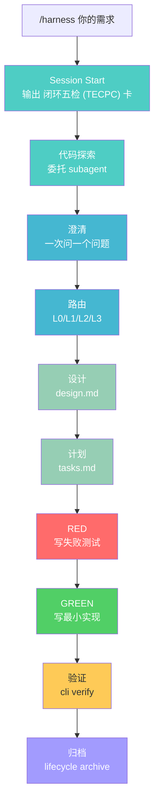

# Enterprise Harness (v0.1.31)

一套围绕 Claude Code 的**工程治理骨架**——用 prompt 约束 + 机械门禁 + durable 状态，让 AI 在团队协作中走得更稳，而不是更自由。

> 它不是一个完整的交付平台，而是一个帮你给 Claude Code 上规矩的基础设施。

## 闭环五检 (TECPC)：这个项目是怎么工作的

闭环五检 (TECPC) 是本项目的核心方法论——五个维度，缺一不可：

| 维度 | 含义 | 在本项目中 |
|------|------|-----------|
| **T 目标** | 要达成什么？什么叫成功？ | 每个 change 都有明确的目标和成功标准 |
| **E 证据** | 用什么证明当前步骤对了？ | ✓/▸/○ 阶梯 + validation/reviewer 证据链 |
| **C 上下文** | 知道什么？还缺什么？ | 探索代码/文档后才问用户，不凭空猜 |
| **P 路径** | 为什么这么走？还有哪些路径？ | 路由决策（L0-L3）有理由，可回溯 |
| **C 纠正** | 发现偏差后怎么办？ | BLOCK 消息 + 恢复入口，不是死胡同 |

## 一个需求进来，会发生什么



### 每一步的 闭环五检 (TECPC) 验收

| 步骤 | T 目标 | E 证据 / P 纠正（你应该看到） | 门禁级别 |
|------|------|-------------------------|---------|
| **Session Start** | 知道当前状态 | `[Harness 进度卡]` 含 ✓/▸/○ 阶梯 | 程序强制 |
| **代码探索** | 了解项目结构 | 通过 `code-explore` subagent 探索 | prompt 约束 |
| **澄清** | 把需求变明确 | Claude 一次问你一个问题 | prompt 约束 |
| **路由** | 确定复杂度 tier | `state.json` 中 tier 有值 | prompt 约束 |
| **设计** | TECPC 驱动的完整设计 | `design.md` 含 T/E/C/P/C 五维 + reviewer pass | 程序强制 |
| **计划** | 拆成可执行任务 | `tasks.md` 存在 + plan critic pass | 程序强制 |
| **RED** | 证明问题存在 | 测试先失败（RED 证据） | prompt 约束 |
| **GREEN** | 最小实现通过 | 测试通过（GREEN 证据） | prompt 约束 |
| **验证** | 确认无回归 | `cli.mjs verify` OK + validation fresh | 程序强制 |
| **归档** | 结束 change | change 移入 `harness/archive/` | 程序强制 |

**程序强制** = Node.js hook 拦截，不管模型多弱都生效  
**prompt 约束** = SKILL.md 文字指令，强模型遵守，弱模型可能跳过

### 闭环五检 (TECPC) 进度卡

任何时候你都可以看到这张卡（session-start / `cli status` / BLOCK 时自动输出）：

```
┌─ hard-delete-template (L2) ─
│ T 目标    ▸ 模板支持硬删除，级联清理关联数据
│ E 证据    ▸ design approved | RED verified
│ C 上下文  ▸ tasks.md 不存在，需先完成任务拆分
│ P 路径    ▸ 涉及 API + 数据变化，故 L2
│ C 纠正    ▸ /harness-plan
│ Ladder
  ✓ clarify
  ✓ route
  ✓ design
  ▸ plan
  ○ tdd
  ○ verify
  ○ archive
└─
```

## 核心价值：机械门禁

这是本项目与其他 AI 工作流框架**最本质的区别**——它不是靠"提示词建议 AI 自觉"，而是有**真实程序拦截违规操作**：

### pre-explore hook（探索代码前）

主 orchestrator 直接用 Grep/Read/Glob 探索业务代码时：
- 无 active change 但有 change tracking → **BLOCK**（必须委托 code-explore subagent）
- 已有 codegraph 证据 → 放行
- 读 harness/ 内部文件、CLAUDE.md、docs、配置 → 放行（豁免）

### pre-write hook（写代码前）

12 道拦截，按顺序检查：

| # | 检查 | 触发条件 |
|---|------|---------|
| 1 | 路径保护 | 写 `rules/` / `agents/` 历史目录 |
| 2 | 路径保护 | 写 `harness/archive/` 冻结目录 |
| 3 | ACTIVE_CHANGE | 未设置 active change |
| 4 | state=DRAFT | change 还没推进 |
| 5 | state=ARCHIVED/REJECTED | change 已结束 |
| 6 | **clarify 产物** | `requirements.md` 缺失 或 `userConfirmedScope=false` |
| 7 | **route 产物** | `tier` 未设置 |
| 8 | **design 产物** | `design.md` 不存在 |
| 9 | **plan 产物** | `tasks.md` 不存在 |
| 10 | **codegraph 证据** | `tooling.codegraph` 仍为 unknown/空 |
| 11 | designApproved | 设计未批准 |
| 12 | RED 证据 | 测试未先失败 |

**模型跳过任何阶段、或未记录 codegraph 使用都会被程序级 BLOCK**，不依赖模型自觉。

### post-write hook（写代码后）

- artifact 完整性检查（`change.md` / `validation.md` / `evidence/tooling.md`）
- OpenAPI 结构检查（任意 `openapi/*.yaml`）
- **通用 OpenAPI ↔ Controller 一致性检查**（path + method 对齐）

### stop hook（会话结束前）

- validation stale → BLOCK
- reviewer verdict 未满足 → BLOCK
- 输出 闭环五检 (TECPC) 卡（v0.1.19+）

## 安装

### 方式 A：Claude Code 会话里（推荐）

```
/plugin marketplace add https://github.com/Emtemf/enterprise-harness
/plugin install enterprise-harness@enterprise-harness
```

### 方式 B：终端

```bash
claude plugin marketplace add https://github.com/Emtemf/enterprise-harness
claude plugin install enterprise-harness@enterprise-harness --scope local
```

### 方式 C：手动安装（离线/代理/TLS 不稳）

从 [Releases](https://github.com/Emtemf/enterprise-harness/releases) 下载 tarball：

```bash
tar -xzf enterprise-harness-*.tar.gz -C /tmp/eh
cd /tmp/eh
node bin/install.mjs --target /path/to/your/project
```

## 使用：两种运行模式，同一套门禁

harness 的门禁和 TECPC 卡跑在**真实的 Node.js 脚本**上，不依赖宿主环境。
所以无论你用什么客户端，门禁都生效。区别只在于"谁触发"。

### 模式 A：原生 Claude Code（自动挡）

通过 `/plugin install` 安装后，Claude Code 的 PreToolUse/PostToolUse/Stop/SessionStart
生命周期会**自动执行** harness 的 hook。你只需要打字，门禁在后台兜底。

- 写代码前 → 12 道拦截自动检查
- 被拦 → 看到 BLOCK + TECPC 卡
- 会话开头 → 自动输出 TECPC 卡

**用户唯一入口**：`/harness`

### 模式 B：非原生宿主（手动挡）

如果你的环境**不是原生 Claude Code**——比如 opencode、基于 Claude Code SDK 的二次开发客户端、
或纯 CI/CD——宿主不会自动触发 hook。这时用 runtime CLI 手动驱动：

```bash
node harness/plugin/runtime/cli.mjs start-change my-feature wula L2 "模板硬删除"
node harness/plugin/runtime/cli.mjs status          # 看当前 TECPC 卡
node harness/plugin/runtime/cli.mjs verify          # 跑契约检查（含 TECPC 卡）
node harness/plugin/runtime/cli.mjs lifecycle state my-change SPECIFIED
node harness/plugin/runtime/cli.mjs doctor          # 环境体检
```

或用全局 bin：

```bash
enterprise-harness status
enterprise-harness verify
node bin/enterprise-harness.mjs <command>
```

### 为什么两种模式门禁都生效？

因为门禁逻辑在 `harness/plugin/runtime/hooks/*.mjs`——是纯 Node.js 脚本，
读的是**项目目录里的 `harness/` 状态文件**（`state.json` / `ACTIVE_CHANGE` / `design.md` 等）。

| 模式 | 谁触发 hook | 读写的状态 | 门禁是否生效 |
|------|------------|-----------|-------------|
| A 原生 Claude Code | Claude Code 生命周期（`$CLAUDE_PROJECT_DIR`） | 你的项目 `harness/` | ✅ |
| B 非原生 / CI | 你手动跑 CLI（`process.cwd()`） | 同一份 `harness/` | ✅ |

两种模式**共享同一份 durable 状态**：
- 你在会话里建的 change → CLI 的 `status` 能看到
- 你用 CLI 建的 change → 会话里的 hook 也会读到

### 更新插件

```bash
claude plugin marketplace update enterprise-harness
claude plugin update enterprise-harness@enterprise-harness --scope local
```

## 诚实边界

### 什么是真正强制的（程序拦截）

- 探索业务代码时被 pre-explore hook BLOCK（除非已委托 subagent 或有 codegraph 证据）
- 受治理路径（`src/main/java`、`src/test/java`、`openapi/`）的 **12 道写入前检查**（含 codegraph 证据门禁）
- 变更资产完整性检查
- OpenAPI ↔ Controller 一致性检查
- 验证新鲜度检查

> `cli.mjs verify` 只声明 contract checks；runtime readiness 需另行运行 doctor / sync / upstream-check。

### 什么是"建议遵守"的（prompt 约束）

- 一次只问一个问题 + 展示歧义评分
- 先澄清再动手
- TDD 严格 RED→GREEN→REFACTOR
- subagent 标题对准用户项目（不得写 `enterprise-harness`）

### 什么还没实现

- ArchUnit 架构门禁
- JaCoCo 覆盖率机械检查
- 真实 HTTP API E2E

## 适合谁 / 不适合谁

**适合**：
- Java 后端团队，想让 AI 在有约束的流程下工作
- 需要 durable 状态和可追溯变更记录的团队
- 弱模型场景，需要额外约束兜底

**不适合**：
- 只想做快速原型、不想走流程
- 前端为主
- 期待"一问就出代码"的体验

## 设计理念

这个项目借鉴了五个参考实现：
- **分阶段 SOP** ← Superpowers
- **归档与资产分层** ← OpenSpec
- **苏格拉底式澄清** ← deep-interview
- **打断后可继续** ← gump（durable state）
- **角色视角** ← role-workbench

目标是让较弱的模型在明确约束下也能稳定工作——但约束本身也有边界，不是万能的。

## 维护者命令

```bash
node harness/plugin/runtime/cli.mjs doctor     # 环境体检
node harness/plugin/runtime/cli.mjs verify     # 契约检查（含 闭环五检 (TECPC) 卡）
node harness/plugin/runtime/cli.mjs status     # 当前状态（含 闭环五检 (TECPC) 卡）
```

## 深入阅读

- **[docs/zh-cn/tecp-user-acceptance-guide.md](docs/zh-cn/tecp-user-acceptance-guide.md)** — **闭环五检 (TECPC) 五维验收指南**（每步的预期/实际/证据）
- [docs/zh-cn/full-lifecycle-truth.md](docs/zh-cn/full-lifecycle-truth.md) — 每个步骤的真相文档（时序图 + 涉及文件 + 产出 + checklist + 异常检测）
- `PROGRESS.md` — 当前进度
- `CLAUDE.md` — 项目约束
- `AGENTS.md` — 仓库协作合同
- `harness/specs/staged-workflow.md` — 分阶段工作流规范
- `harness/specs/session-lifecycle.md` — 会话生命周期规范

## License

Apache-2.0
