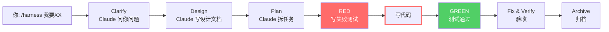

# Enterprise Harness

一套围绕 Claude Code 的**工程治理骨架**——用 prompt 约束 + 机械门禁 + durable 状态，让 AI 在团队协作中走得更稳，而不是更自由。

> 它不是一个完整的交付平台，而是一个帮你给 Claude Code 上规矩的基础设施。

## 核心价值：机械门禁

这是本项目与其他 AI 工作流框架**最本质的区别**——它不是靠"提示词建议 AI 自觉"，而是有**真实程序拦截违规操作**：

| 拦截点 | 触发条件 | 结果 |
|--------|---------|------|
| **写代码前**（pre-write） | 写 `src/main/java`、`src/test/java`、`openapi/` 等受治理路径，但 `designApproved=false` 或 RED 证据不足 | **直接报错 BLOCK，写不进去** |
| **写代码后**（post-write） | 缺少 `change.md`/`validation.md`/`evidence/tooling.md` | **报错，阻止继续** |
| **会话结束前**（stop） | 验证数据是 stale（过期） | **拦住，不让你假装完成** |

这 4 个 hook 是**跑在你机器上的 Node.js 程序**（`pre-write.mjs`/`post-write.mjs`/`stop.mjs`/`session-start.mjs`），通过 `.claude/settings.json` 注册到 Claude Code 的 PreToolUse/PostToolUse/Stop 生命周期。不管模型多弱，程序拦截都会生效。

已验证支持：任意项目路径（`foo-service/src/main/java`、`order-service/src/test/java` 等），不再限于本仓库自带的 `reference-service` demo。

## 它还提供什么

**工作流 prompt（模型自觉层）**

`/harness` 命令引导 Claude 按澄清→设计→计划→TDD→验证的流程推进。这是 SKILL.md 里的文字指令，Claude 会尝试遵守，但本质是"建议"。强模型（Opus/Sonnet）通常遵守，弱模型可能跳过。

**状态管理（打断后可恢复）**

每个 change 都有 `state.json` + `validation.md` + reviewer verdict。即使 Claude 会话中断，下次恢复时能看到之前做到哪一步。

## 一个需求进来，会发生什么



**哪些是真正强制的（程序拦截）：**
- 写 `src/main/java` 前：没有 `designApproved` → 被拦
- 写完代码后：缺少变更文档 → 报错
- 会话结束前：验证数据过期 → 被拦

**哪些是"建议遵守"的（模型自觉）：**
- 先探索代码再动手
- 一次只问一个问题
- 先设计再编码

> 完整的 15 步时序图、每步涉及的文件、产出、checklist，见
> [docs/zh-cn/full-lifecycle-truth.md](docs/zh-cn/full-lifecycle-truth.md)（面向开发者/维护者）

## 安装

### 方式 A：Claude Code 会话里（推荐）

```
/plugin marketplace add https://github.com/Emtemf/enterprise-harness
/plugin install enterprise-harness@enterprise-harness
```

### 方式 B：终端

```bash
claude plugin marketplace add https://github.com/Emtemf/enterprise-harness
claude plugin install enterprise-harness@enterprise-harness --scope local
```

### 方式 C：手动安装（离线/代理/TLS 不稳）

从 [Releases](https://github.com/Emtemf/enterprise-harness/releases) 下载 tarball：

```bash
tar -xzf enterprise-harness-*.tar.gz -C /tmp/eh
cd /tmp/eh
node bin/install.mjs --target /path/to/your/project
```

## 使用

安装后唯一入口：`/harness`。

在任意项目里输入 `/harness`，Claude 会先澄清需求，再走流程。改代码时门禁自动生效。

### 每一步应该看到什么

| 步骤 | 应该看到 | 如果没看到 |
|------|---------|-----------|
| 启动 | 会话开头有 `[Harness 启动检查] ...` 输出 | 插件没安装，重新 `plugin install` |
| 代码探索 | Claude 调用 `codegraph_explore` / `codegraph_search` | 弱模型跳过了，提 issue |
| 需求澄清 | Claude 一次只问一个问题，用选项式回答 | 弱模型跳过了，提 issue |
| 写代码前 | 如果 `designApproved=false`，被 BLOCK | hook 没触发，提 issue |
| 会话结束 | 如果 validation 不是 fresh，被 stop hook 拦截 | 正常行为 |

完整检查清单见 [docs/zh-cn/expected-behavior-checklist.md](docs/zh-cn/expected-behavior-checklist.md)。

**提 issue 时请提供**：① 用的模型 ② 哪一步不符合预期 ③ 实际输出 ④ 期望输出 ⑤ `node harness/plugin/runtime/cli.mjs status` 的结果。

## 诚实边界

### 什么是真正强制的

- 受治理路径（`src/main/java`、`src/test/java`、`openapi/`）的写入前检查
- 变更资产完整性检查
- 验证新鲜度检查

### 什么是"建议遵守"的

- 一次只问一个问题
- 先澄清再动手
- reviewer block 时不进入下一阶段
- TDD 严格 RED→GREEN→REFACTOR

这些是 SKILL.md 和 `.claude/rules/` 里的文字指令。Claude 强模型通常会遵守，弱模型可能跳过。

### 什么还没实现

- ArchUnit 架构门禁
- JaCoCo 覆盖率机械检查
- 真实 HTTP API E2E

## 适合谁 / 不适合谁

**适合**：
- Java 后端团队，想让 AI 在有约束的流程下工作
- 需要 durable 状态和可追溯变更记录的团队
- 弱模型场景，需要额外约束兜底

**不适合**：
- 只想做快速原型、不想走流程
- 前端为主
- 期待"一问就出代码"的体验

## 设计理念

这个项目借鉴了五个参考实现：
- **分阶段 SOP** ← Superpowers
- **归档与资产分层** ← OpenSpec
- **苏格拉底式澄清** ← deep-interview
- **打断后可继续** ← gump（durable state）
- **角色视角** ← role-workbench

目标是让较弱的模型在明确约束下也能稳定工作——但约束本身也有边界，不是万能的。

## 维护者命令

```bash
node harness/plugin/runtime/cli.mjs doctor     # 环境体检
node harness/plugin/runtime/cli.mjs verify     # 契约检查
node harness/plugin/runtime/cli.mjs status     # 当前状态
```

## 深入阅读

- **[docs/zh-cn/full-lifecycle-truth.md](docs/zh-cn/full-lifecycle-truth.md)** — **每个步骤的真相文档**（时序图 + 涉及文件 + 产出 + checklist + 提 issue 条件）
- [docs/zh-cn/expected-behavior-checklist.md](docs/zh-cn/expected-behavior-checklist.md) — 快速定位指南
- `PROGRESS.md` — 当前进度
- `CLAUDE.md` — 项目约束
- `AGENTS.md` — 仓库协作合同
- `harness/specs/staged-workflow.md` — 分阶段工作流规范

## License

Apache-2.0
