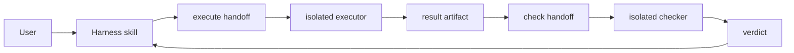

# 架构

Enterprise Harness 分为五层：

| 层 | Clarify ownership | 不负责 |
|---|---|---|
| Skill | 顺序编排、lane applicability 方法、topology/五维综合、一次一个 Decision、产物导航和下一步 | schema、digest 或 transition 的机械判定 |
| Agent | CodeGraph/Context7 事实采集、artifact 生成或独立 review；每个 run 有明确身份、工具和 handoff scope | Main 的用户决策与全局阶段推进 |
| Hook | 在 `AskUserQuestion` 前校验 pending authorization，完成后归因当前调用并追加公开 DecisionEvent | 事实探索、评分、推荐、债务/合同取舍或 readiness 计算 |
| Runtime | safe path、schema、digest、append/seal、assessment/classification validation、readiness 和 completion proof | 自主选择产品选项或解释用户意图 |
| Spec | 长期合同 | 动态状态 |

主 orchestrator 从 `/enterprise-harness:harness` 恢复阶段。受治理行为创建 execute handoff，派隔离 executor；executor 只写 result。主 orchestrator 再创建 check handoff，checker 从 result artifact 获取上下文。

worktree 解决文件/分支隔离，subagent 解决上下文隔离，runId 和 digest 解决接力身份与新鲜度。

## Clarify 的 ledger 与 snapshot

Decision Ledger 是 append-only 的可增长历史：lane applicability、用户回答、debt/project-contract
disposition、scope confirmation 和 classification route 都以公开事件追加。它只记录授权选择、公开理由和
evidence refs，不保存 transcript 或 hidden reasoning。Main 负责提出 user-only Decision；hook 只把当前
已预授权的 host 调用可靠归因给 runtime。

Clarify decision snapshot 是 ledger 某个有序 prefix 的 immutable、digest-bound 封印。后续向 live ledger
追加事件不会改写旧 snapshot；如果 completion 所需 prefix 中任一事件或输入改变，必须产生新 snapshot，
并使依赖它的 classification、StageResult、review 和 proof 失效。requirements 与 assessments 在封印前是
可更新 working artifacts；readiness 是 runtime 从 authoritative artifacts 计算的内存投影，不另存一份可编辑
checklist。

Clarify completion 的 ownership 链是：Skill 编排 Main-produced artifacts/self-check → 独立 reviewer 消费同一
digest set → runtime 验证完整 TECPC 与 ClarifyProof → lifecycle gate 决定能否进入 Design。Hook 始终保持轻，
不能取代上述任一层。

plugin 使用 `${CLAUDE_PLUGIN_ROOT}`；本仓库开发通道使用 `$CLAUDE_PROJECT_DIR`。两套 hook 配置由同一 manifest 生成。

上游设计来源包括 Superpowers、OpenSpec、deep-interview、CodeGraph 和 Context7，但本仓库只维护自己的稳定合同，映射见 `harness/specs/upstream-mapping.md`。
