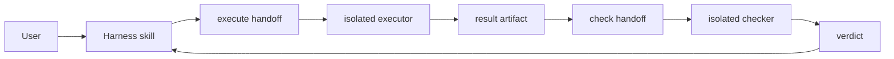

# 架构

Enterprise Harness 分为五层：

| 层 | 职责 | 不负责 |
|---|---|---|
| Skill | 阶段编排、输入输出和下一步 | 机械证据判定 |
| Agent | 身份、工具权限、上下文隔离 | 全局流程推进 |
| Hook | 最小前后 gate、事件记录 | 需求分析和设计 |
| Runtime | schema、路径、receipt、状态和 completion | 自主产品决策 |
| Spec | 长期合同 | 动态状态 |

主 orchestrator 从 `/enterprise-harness:harness` 恢复阶段。受治理行为创建 execute handoff，派隔离 executor；executor 只写 result。主 orchestrator 再创建 check handoff，checker 从 result artifact 获取上下文。

worktree 解决文件/分支隔离，subagent 解决上下文隔离，runId 和 digest 解决接力身份与新鲜度。

plugin 使用 `${CLAUDE_PLUGIN_ROOT}`；本仓库开发通道使用 `$CLAUDE_PROJECT_DIR`。两套 hook 配置由同一 manifest 生成。

上游设计来源包括 Superpowers、OpenSpec、deep-interview、CodeGraph 和 Context7，但本仓库只维护自己的稳定合同，映射见 `harness/specs/upstream-mapping.md`。
