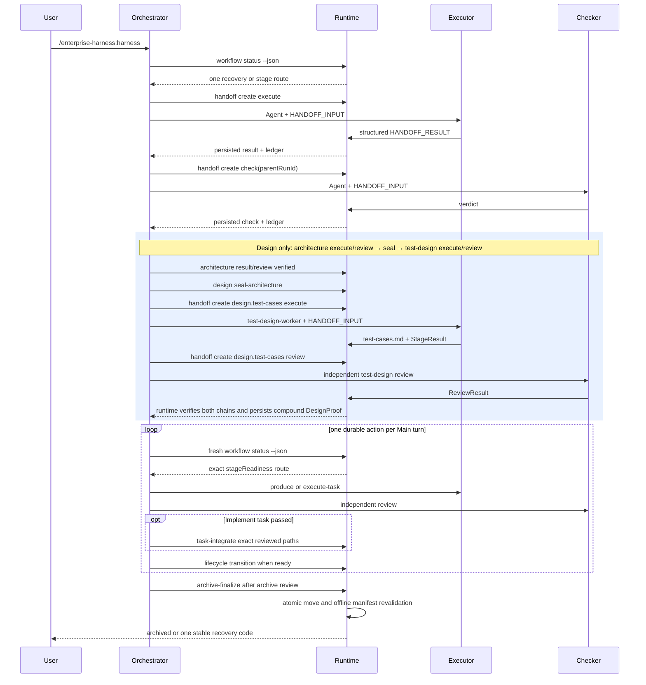

# Runtime 时序

关键失败路径：

- input 缺失：`EH-HANDOFF-INPUT-001`
- schema 漂移：`EH-HANDOFF-SCHEMA-002`
- agent/run 不一致：`EH-AGENT-BINDING-003`
- result 无法解析：`EH-SUBAGENT-RESULT-004`
- checker 缺失：`EH-CHECKER-REQUIRED-005`

输出示例不在本文手写维护。CLI 输出由行为测试和 JSON contract 验证。

Design 仍是六个生命周期阶段之一。只有 architecture execute/review 链闭合后才能 seal；`test-design` 只消费
该 fresh sealed chain；Plan、Verify 和 Archive 消费 compound `DesignProof` 与当前 `test-cases.md`。

Design 后 Main 不根据聊天或文件存在性猜动作。每轮重新读取 runtime 投影，只执行一个
produce/review/integrate/select/transition/finalize route；中断、重启或 compaction 后使用相同机制恢复。
详细 schema、命令和 gate 仍以 specs/runtime 为准，不在本时序说明中复制。
