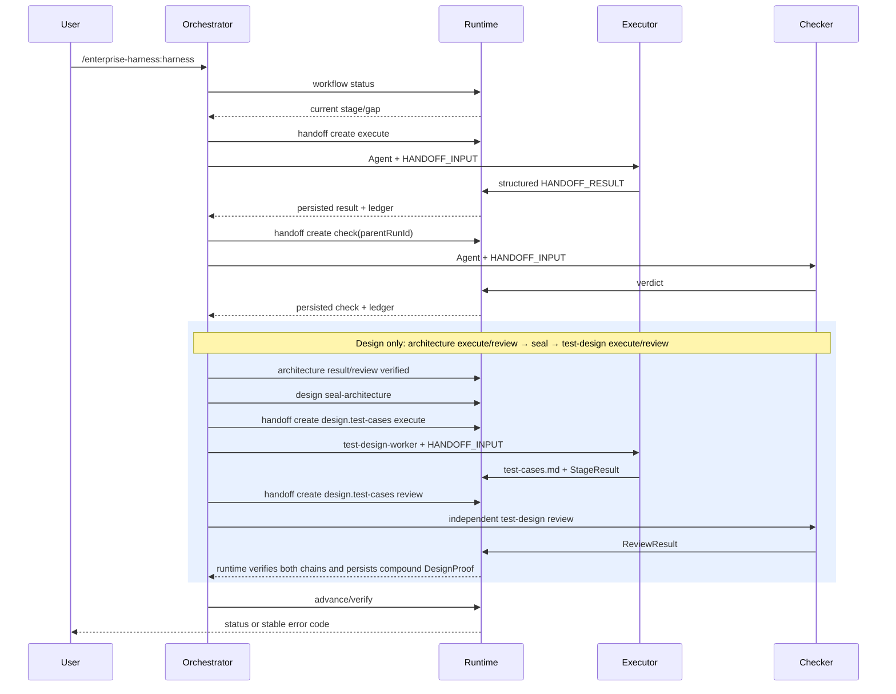

# Runtime 时序

关键失败路径：

- input 缺失：`EH-HANDOFF-INPUT-001`
- schema 漂移：`EH-HANDOFF-SCHEMA-002`
- agent/run 不一致：`EH-AGENT-BINDING-003`
- result 无法解析：`EH-SUBAGENT-RESULT-004`
- checker 缺失：`EH-CHECKER-REQUIRED-005`

输出示例不在本文手写维护。CLI 输出由行为测试和 JSON contract 验证。

Design remains one of the six lifecycle stages. The seal is only legal after the architecture execute/review
chain; `test-design` only consumes that sealed chain; Plan, Verify, and Archive consume the resulting compound
`DesignProof` and current `test-cases.md`. Detailed test-case schema and gate rules belong to the specs/runtime, not
this timing guide.
