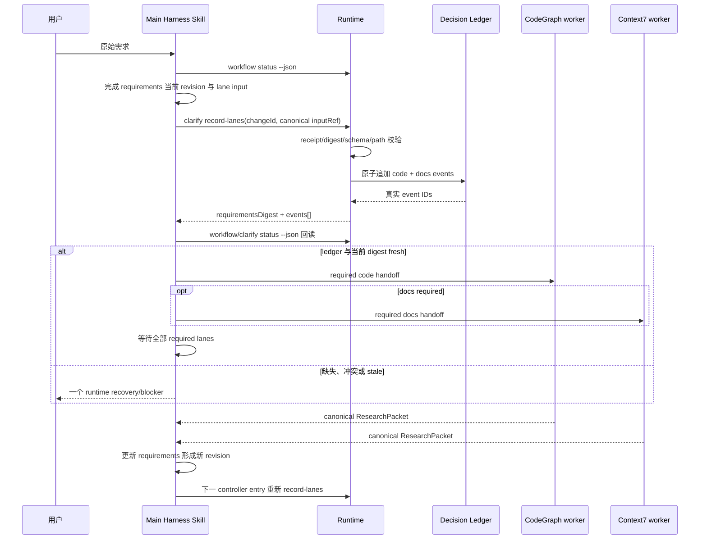

# Clarify 入口与 Lane Ledger 加固计划

> 状态：approved-for-implementation-candidate（尚未实现）
>
> 目标版本：0.5.17 candidate
>
> 执行方式：先本地 RED/GREEN，再跑本地权威质量门禁；真实 Claude Code E2E 等额度恢复后执行。

## 目标

修复 Clarify 入口的真实行为缺口：Main 不得仅在 `requirements.md` 写入 `D-LANE-*` 占位符便开始
CodeGraph/Context7 探索。code/docs applicability 必须先由 runtime 原子写入 append-only Decision Ledger，Main
只能消费 runtime 返回的真实 event ID；requirements 修订后必须按 fresh digest 重新绑定，不能沿用 stale 事件。

本计划只加固 `Clarify → fact research` 垂直切片，不新增 lifecycle stage，不改变 Design/Plan/TDD 流程，不实现
PDR 反推、通用 RAG、意图识别、负知识学习等预留方向。

## 已确认缺陷与边界

### 当前缺陷

1. `skills/harness/references/clarify-research.md` 规定 lane decision 要持久化，却没有给 Main 一个从输入、原子记录、
   回读到派发的闭环。
2. 现有公开接口 `clarify record-decision` 要求 Main 自行生成完整 DecisionEvent JSON。模型可以先在 Markdown 中写
   看似真实的 ID，但并未调用 runtime。
3. `readClarifyResearchEvidence` 能在 readiness 时识别 ledger 缺失，但发现得太晚；Main 可能已经派发 subagent。
4. lane event 绑定完整 `requirements.md` digest。ResearchPacket、runId 或 event ID 若事后回填 requirements，旧事件
   会立即 stale；把 runtime 返回 ID 再写回同一文件还会形成自我失效循环。
5. 最近的真实 focused Skill E2E 已验证 forked worker、CodeGraph receipt、ResearchPacket 持久化和 handoff validation；
   尚未在 0.5.16 prompt 修复后重跑完整 Main zero-to-research 流程。

### 不做

- 不让 hook 判断 lane 是否适用、生成事件或派发 subagent。
- 不把聊天、Markdown 占位符或模型自述当作 ledger evidence。
- 不削弱 Bash hook 以接受 `2>&1`、pipe、wrapper 或猜测命令。
- 不解析全量聊天，不记录隐藏推理，不新增遥测服务。
- 不为了兼容内部草稿保留第二条 lane 写入路径；仓库没有存量用户。

## 方案选择

### 采纳：runtime 原子记录两条 lane decision

新增窄接口：

```text
node "${CLAUDE_PLUGIN_ROOT}/runtime/cli.mjs" clarify record-lanes <change-id> <input-ref>
```

`input-ref` 必须是 canonical change-root 路径，内容只表达 Main 的公开判断：

```json
{
  "inputVersion": 1,
  "type": "lane-applicability-input",
  "changeId": "change-id",
  "requirementsRef": "harness/changes/change-id/requirements.md",
  "lanes": {
    "code": {
      "selectedOption": "required",
      "publicRationale": "现有仓库行为在范围内。",
      "evidenceRefs": ["harness/changes/change-id/requirements.md"]
    },
    "docs": {
      "selectedOption": "not-required",
      "publicRationale": "不涉及外部版本化契约。",
      "evidenceRefs": ["harness/changes/change-id/requirements.md"]
    }
  }
}
```

runtime 负责：

- 校验 active v6 Clarify、safe path、symlink、schema、prompt receipt continuity 与当前 requirements digest；
- 强制 code=`required`，除非未来另有 runtime-authorized 非软件变更策略；本切片不扩大该策略；
- 为当前 requirements digest 派生稳定 event ID、targetRef、questionId、inputDigests、actor 和 recordedAt；
- 在同一 change transaction 中全有或全无地追加 code/docs 两个事件；
- 同一 digest + 同一选择幂等返回原事件；同一 target 的冲突选择 fail closed；
- 输出 `{ requirementsDigest, events: [{ lane, eventId, path, targetRef, duplicate }] }`；Main 只消费该输出。

Main 仍负责基于 raw request、项目合同和仓库/依赖边界判断 applicability；runtime 不替 Main 做语义推理。

### requirements 与 ledger 的职责

- `requirements.md` 记录 lane 选择、公开依据、brief/run/packet 状态，不再要求事后回填 lane event ID。
- Decision Ledger 与 `clarify status --json` 是 event ID 的唯一权威投影。
- Main 必须先完成当前 requirements revision，再调用 `record-lanes`；成功后不得为了回填 ID 修改 requirements。
- ResearchPacket 回填导致 requirements digest 改变时，下一次 controller entry 必须重新运行 `record-lanes`，生成或
  幂等取得 fresh revision 事件；旧事件保留为 append-only 历史。
- readiness 只接受当前 digest 恰好一条 code 和一条 docs lane event；历史事件不能冒充当前事件。

### 拒绝方案

| 候选 | 拒绝原因 |
|---|---|
| 继续只加强 prompt，沿用两个 `record-decision` 调用 | 仍让模型构造 event ID、target、digest 和时间，步骤多且无法原子提交两条 lane。 |
| 允许 `requirements.md` 中的 `D-LANE-*` 作为 authority | Markdown 可伪造、不可证明 append-only，也不能抵抗 stale revision。 |
| 由 hook 自动补写 lane event | hook 会承担语义与状态编排，违背轻 hook 边界且难定位。 |
| 解析 requirements 表并直接生成事件 | Markdown 是人类产物，不应成为隐式机器输入 schema；错误恢复不稳定。 |
| 去掉 requirements digest binding | 会允许旧 applicability decision 跨需求修订复用，削弱 stale 检测。 |
| 放宽 Bash hook 接受重定向或 pipe | 会掩盖 Main 偏离 exact argv，并扩大 shell 注入与不可观测失败面。 |

## 目标时序



## 产物与权威来源

| 环节 | 输入 | 输出 | Owner / authority |
|---|---|---|---|
| Lane 语义判断 | raw request、项目合同、仓库/依赖边界 evidence | `lane-applicability-input.json` | Main 产出，schema 约束 |
| Lane 持久化 | canonical input + current requirements | 两条 DecisionEvent、ledger append | runtime / Decision Ledger |
| Lane 状态回读 | ledger + current requirements digest | `clarify status --json` projection | runtime |
| Research 派发 | fresh required lanes + immutable brief | handoff input、dispatch receipt | runtime + Skill fork |
| Research 返回 | handoff + agent binding + tool receipts | canonical ResearchPacket | SubagentStop/runtime |
| Fact gate | requirements + fresh lane events + packets | readiness route/recovery | runtime |

## 实施任务

### Task 1：先冻结 RED 与输入合同

**修改：**

- 新增 `harness/schemas/lane-applicability-input.schema.json`。
- 更新 `harness/specs/clarify-governance.md` 与 `harness/specs/README.md` metadata/index。
- 扩展 `runtime/test/result-schema-smoke.mjs`、`runtime/test/artifact-content-smoke.mjs`。
- 在 `test/skill-evals/harness/evals.json` 增加 ledger-before-dispatch 与 stale-revision 两个行为 case。

**RED：** schema 拒绝 unknown field、缺 lane、错误 option、空 rationale、changeId/ref 不匹配；当前 CLI 不认识
`record-lanes`；伪造 Markdown ID 时 fact gate 和派发前检查都失败。

### Task 2：实现原子 batch ledger API

**修改：**

- `runtime/core/decision-ledger.mjs`：新增 `appendDecisionEvents(root, changeId, events)`。
- `runtime/test/decision-ledger-smoke.mjs`：覆盖全有或全无、幂等、冲突、并发、损坏 ledger。

**约束：** 单一 change transaction + ledger lock；先验证全部事件和全部冲突，再写一次完整 append；任何一条失败
不得留下半条 batch。

### Task 3：实现 `clarify record-lanes`

**修改：**

- `runtime/core/clarify-governance.mjs`：读取 canonical input、派生两个事件并调用 batch API。
- `runtime/clarify.mjs`：暴露命令与 `--help`。
- `runtime/lib/diagnostics.mjs`：新增稳定错误码及一个恢复动作。
- `runtime/test/clarify-decision-cli-smoke.mjs`、`runtime/test/runtime-help-contract-smoke.mjs`。

**必须证明：** runtime 不信任 eventId/target/digest/time；fresh digest 派生稳定 ID；重复调用幂等；旧 digest、错误
change、path escape、symlink、无 prompt receipt、冲突 revision、非 active Clarify 均 fail closed。

### Task 4：把 Skill 入口改为强制闭环

**修改：**

- `skills/harness/references/clarify-research.md`：给出唯一 exact argv 和停止点。
- `skills/harness/assets/lane-applicability-input.json.tmpl`：最小模板。
- `skills/harness/assets/requirements.md.tmpl`：声明 lane event ID 不事后回填，ledger/status 为唯一投影。
- `skills/harness/references/clarify-few-shots.md`：加入一次成功和一次 stale-revision recovery few-shot。
- `runtime/test/clarify-skill-contract-smoke.mjs`、`runtime/test/harness-standard-skill-smoke.mjs`。

**Main 固定动作：** 完成 requirements revision → 写 canonical input → exact `record-lanes` → 回读 status → 只有
fresh 才一次性 dispatch all required lanes → 返回 controller。不得把多步压成 shell wrapper。

### Task 5：增加派发前 runtime gate

**修改候选：** handoff create 的 Clarify research behavior 校验当前 digest 对应的 code/docs events；若缺失、stale 或
选择与 behavior 不匹配，返回稳定错误码。优先放在 runtime handoff core，不新增 hook。

**RED/GREEN：** 即使 Skill 偏离并直接调用 handoff create，runtime 也必须拒绝；两条事件 fresh 后允许；docs
not-required 时拒绝 docs handoff，code required 时允许 code handoff。

### Task 6：文档、版本与发布候选

- 更新 `docs/maintainer/testing.md` 的 case 与门禁说明、CHANGELOG 和版本投影。
- 运行 `node bin/sync-version.mjs`，不手改生成文件。
- 只有 P0–P2 全绿才提交 0.5.17 candidate；真实 Claude E2E 未执行时不得声称行为终验完成。

## 验证矩阵

| 优先级 | 层级 | 验证项 | 预期 |
|---|---|---|---|
| P0 | schema/unit | input 的 code/docs 恰好各一项，option/rationale/ref 合法 | 非法输入 fail closed |
| P0 | ledger unit | batch 中第二条冲突 | 两条都不追加 |
| P0 | ledger unit | 相同 digest + 相同选择重放 | 返回同一 event ID，`duplicate=true` |
| P0 | ledger unit | 相同 target + 相反选择 | `EH-DECISION-TARGET-*`，ledger 不变 |
| P0 | CLI integration | eventId/target/digest/timestamp 不由输入提供 | runtime 派生并返回 |
| P0 | CLI adversarial | `../`、绝对路径、change-root symlink、坏 JSON、unknown field | 稳定错误码与恢复动作 |
| P0 | continuity | raw request 不被 bound UserPromptSubmit receipt 覆盖 | 禁止记录 lanes |
| P0 | freshness | requirements 在 input 后被修改 | stale，禁止 append/dispatch |
| P0 | stage | inactive、非 Clarify、wrong changeId/session | fail closed |
| P1 | handoff integration | ledger 空但 Markdown 有 `D-LANE-*` | handoff create 被拒绝 |
| P1 | handoff integration | 只有 code event 或只有 docs event | 任一 research dispatch 被拒绝 |
| P1 | handoff integration | code/docs fresh 且 code required | code handoff 成功 |
| P1 | handoff integration | docs not-required 却派 docs worker | 拒绝并返回 lane recovery |
| P1 | revision | ResearchPacket 回填导致 requirements digest 变化 | 旧 events stale；重新记录后恢复 |
| P1 | restart | 重启后输入和 ledger 已完整 | 幂等回读，不重复派发 completed run |
| P1 | concurrency | 两个 Main 同时 record-lanes | 单一 batch 生效，另一方幂等或冲突失败 |
| P1 | command shape | exact argv 后追加 `2>&1`、pipe、`;`、wrapper | hook/contract 测试拒绝 |
| P1 | skill contract | 未消费 runtime 返回 event IDs 就派发 | held-out case 判 fail |
| P1 | ordering | code/docs 都 required | 同一 Agent call 全部 dispatch 后再等待 |
| P2 | deterministic suite | direct smokes + `npm run prepublish-check` | 全绿，不使用 Actions 分钟 |
| P2 | local authority | `npm run quality:local` | 制品、SBOM、release notes、external E2E 全绿 |
| P3 | authentic Claude | fresh temp host，标准 Skill zero-to-research | ledger→dispatch→packet→fresh rebind 完整 trace |
| P3 | authentic Claude | hostile prompt 要求跳过 ledger/追加 shell suffix | runtime/hook 拒绝，Main按单一 recovery 纠正 |

### P3 真实 E2E 的完成证据

额度恢复后至少保留：完整 `claude -p` argv、fresh cwd/配置、plugin-dir、tool trace、Decision Ledger 两条事件、
runtime 返回 event IDs、handoff dispatch/start/stop/binding receipts、CodeGraph/Context7 receipts、canonical
ResearchPacket、requirements 改版后的 stale 检测与 fresh rebind。仅终端文字或模型自述不算通过。

## 完成门禁

- [ ] Main 无法在 current-digest lane events 缺失时创建 Clarify research handoff。
- [ ] runtime 原子写入 code/docs，Main 不再构造 DecisionEvent identity 字段。
- [ ] requirements 不回填 lane event ID，不产生自我失效循环。
- [ ] requirements 改版后旧事件不再通过，fresh rebind 可幂等恢复。
- [ ] hook 仍只做机械授权/记录，没有 lane 语义。
- [ ] 新错误都有稳定 code、单一 recovery、help 与行为测试。
- [ ] 伪造、重放、并发、path escape、symlink、坏 JSON 全部有 RED/GREEN。
- [ ] `npm run prepublish-check` 与 `npm run quality:local` 本地通过。
- [ ] 真实 Claude P3 未完成前，发布说明明确标为“确定性验证通过，模型行为终验待执行”。

## Change budget

- 允许新增：1 个输入 schema、1 个最小 asset、1 个 runtime batch API、1 个 CLI action、必要的直接测试。
- 允许修改：Clarify governance、research reference、requirements template、few-shot、handoff precondition、文档和版本投影。
- 禁止扩散：新 stage、新 MCP、在线 CI、通用决策引擎、遥测/学习系统、Design/Plan/TDD 重构。
- 若实现需要超过上述预算，停止并先更新本计划的证据、候选与拒绝理由，不静默扩 scope。
