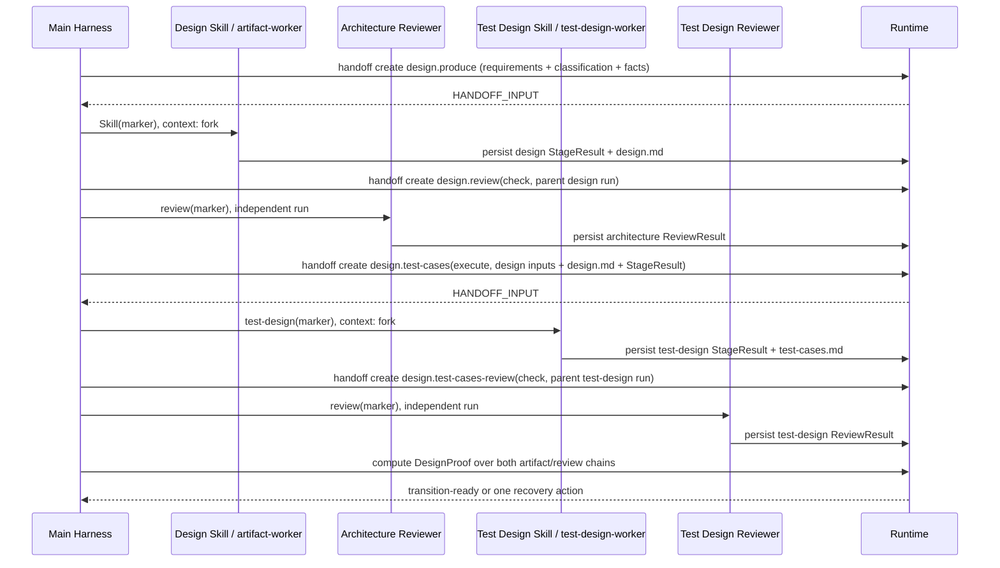

# 独立测试用例设计 Skill 设计

日期：2026-08-28
状态：聊天方案已批准，等待书面规格复核
目标版本：0.5.12

## 1. 问题与目标

0.5.11 将架构设计、可测试性约束和详细测试用例都放进 `design` Skill，导致职责混杂：架构 worker
既决定系统边界，又自行设计证明这些边界正确的完整测试集合。原定企业流程要求两者上下文隔离，并让
Plan、Implement、Verify 消费独立、可追踪的测试用例制品。

本轮目标是在不改变六阶段用户可见 lifecycle 的前提下，将测试用例设计拆成 Design 阶段内的第二个
forked Skill：

```text
clarify → design[architecture-design → test-design → independent reviews] → plan → implement → verify → archive
```

## 2. 范围

### 包含

- 收窄 `design` Skill：只负责架构合同与可验证性义务。
- 新增 `test-design` Skill、模板、references、assertions、scripts、evals。
- 新增权威制品 `harness/changes/<change-id>/test-cases.md`。
- Main Harness 在同一个 Design stage 内按依赖顺序派遣 architecture design 和 test design。
- 分别执行 architecture review 与 test-design review；DesignProof 聚合两条链。
- Plan、Verify、Archive 消费并追踪 `test-cases.md`。
- 使用 digest 让 `requirements.md` 或 `design.md` 变化时自动判定 test cases 和下游证据 stale。

### 不包含

- 不增加 `test-design` lifecycle stage。
- 不在 test-design 中执行测试、操作浏览器或修改产品代码。
- 不在 test-design 中冻结 exact argv、文件清单、类名、方法名或具体测试驱动。
- 不在本轮实现 Playwright CLI、MCP 或 Chrome DevTools 的工具选择；工具选择属于 Plan/Verify。
- 不保留 0.5.11 的双重“Design 测试用例”权威路径；项目无存量用户，直接迁移到新合同。

## 3. 职责边界

### Architecture Design Skill

输入：approved requirements、classification、ResearchPacket、技术债与项目长期合同。
输出：`design.md`。

负责：

- 组件和服务边界、依赖方向、交互和失败语义；
- API、Data/SQL、migration、兼容、回滚；
- 安全、并发、一致性、observability；
- alternatives 和选定决策；
- 每项需求的可验证性义务 `VO*`，描述必须观察到什么，不描述完整测试步骤。

不负责：测试数据、详细步骤、测试层级组合、覆盖矩阵和 E2E 用户旅程。

### Test Design Skill

输入：与 Design 相同的冻结需求和事实，加上 fresh `design.md` 及其 StageResult。
输出：`test-cases.md`。

负责：

- 将 `R* / D* / VO*` 映射到 `TC*`；
- 正常、异常、边界、权限、并发、幂等、超时、重试和回滚场景；
- unit、integration、contract、migration、security 和适用 E2E 的合理分层；
- 每个用例的前置条件、测试数据、动作、可观察断言、清理或恢复要求；
- 对不适用测试层级给出证据绑定的理由；
- 标记仍需用户决策或技术研究的缺口，不自行猜测。

不负责：执行测试、选择浏览器驱动、冻结命令或批准自身产物。

### Plan、Implement、Verify

- Plan 把 `design.md + test-cases.md` 拆成 Task，冻结 RED 测试、exact argv、工具和写入范围。
- Implement 按 Task strategy 真实执行 TDD 或其他已批准策略，产生 receipts。
- Verify 根据 `test-cases.md` 和 Plan 冻结命令重新验证；适用 E2E 在此执行并保留报告、trace、截图或视频引用。

## 4. 时序



Architecture review 先于 test-design 派遣，避免测试用例绑定尚未通过架构挑战的设计。两种 reviewer 必须
与各自 executor 使用不同 run；reviewer 不读取 executor 对话。

## 5. 制品合同

### `design.md`

Requirement trace 调整为：

```text
R* → D* → E* → VO* → RB*
```

`VO*` 是可验证性义务，例如“重复请求只产生一个资源且返回同一资源标识”，不是测试步骤或命令。

### `test-cases.md`

必须包含：

1. 输入摘要与适用测试层级；
2. `R* / D* / VO* → TC*` 覆盖矩阵；
3. 测试用例明细；
4. E2E 用户旅程（适用时）；
5. 测试数据、隔离、清理和恢复；
6. 风险优先级与最小充分集合；
7. 未决项和 self-check。

每个 `TC*` 至少具有：

| 字段 | 语义 |
|---|---|
| ID | 当前 change 内稳定的 `TC<number>` |
| Traces | 至少一个已声明的 R、D 和 VO |
| Level | unit/integration/contract/migration/security/E2E |
| Priority | critical/high/normal |
| Preconditions | 可建立且可审计的状态 |
| Data | 输入、身份和关键边界值 |
| Actions | 业务动作，不是具体工具 argv |
| Observable assertions | 用户或系统可观察结果 |
| Cleanup/Recovery | 数据清理、状态恢复或 N/A 理由 |

禁止使用“正常即可”“验证成功”“覆盖异常”等不可观察措辞作为唯一断言。

## 6. Skill 与 agent 架构

新增：

```text
skills/test-design/
  SKILL.md
  assets/test-cases.md.tmpl
  references/method.md
  references/artifact-contract.md
  references/self-check.md
  references/examples.md
  assert/artifact-shape.mjs
  assert/coverage.mjs
  assert/traceability.mjs
  scripts/prepare-input.mjs
  scripts/finalize-result.mjs
  evals/evals.json

agents/test-design-worker.md
skills/review/references/test-design.md
```

`test-design` 使用官方 Skill frontmatter：

- `user-invocable: false`
- `context: fork`
- `agent: enterprise-harness:test-design-worker`
- `argument-hint: HANDOFF_INPUT=<canonical-input.json-path>`

不使用 Skill 不支持的 `background` 字段。agent 仅允许读取冻结输入和写入 `test-cases.md`，不能修改产品代码、state 或其他阶段制品。

## 7. Handoff 与运行时绑定

新增 execute behavior `design.test-cases`。handoff 至少绑定：

- current `requirements.md`；
- classification artifact；
- current `design.md`；
- architecture design StageResult；
- Design 使用的全部事实输入。

prepare 和 finalizer 都必须验证：

- marker 是 envelope `changeId/runId` 对应的 canonical `input.json`；
- change 仍为 schema v6、lifecycle active、stage design；
- agent type/skill/behavior/role 正确；
- requirements、classification、design 及 Design StageResult 均在 inputRefs 且 digest fresh；
- Design StageResult 与 design execute handoff 身份一致且为 pass；
- 没有 symlink 逃逸、path traversal 或重复 result overwrite。

finalizer 运行全部 assertions 后原子持久化 test-design StageResult。stdout 不是权威结果，durable result 才是。

## 8. Review 与 DesignProof

Architecture Review 继续审查架构完整性和 `VO*` 是否可观察，但不审查详细用例质量。

Test Design Review 独立审查：

- 每个 R/D/VO 是否至少有一个 TC；
- critical failure mode、权限、并发、幂等、迁移/回滚是否按影响覆盖；
- 是否过度依赖 mock 或仅有 happy path；
- E2E 是否只覆盖关键用户旅程且断言可观察；
- 数据准备、隔离、清理是否可执行；
- 是否提前冻结具体工具或把 unsupported 当 pass。

DesignProof 必须同时绑定：

- passing architecture StageResult；
- passing architecture ReviewResult；
- passing test-design StageResult；
- passing test-design ReviewResult；
- 两个制品和全部输入 digest；
- TECPC correction 状态。

任一链 stale 或 block 时不得进入 Plan，只返回最早的一个恢复动作。

## 9. Stale 与下游关系

依赖关系调整为：

```text
requirements/classification/facts → design
requirements/classification/facts/design/design-result → test-cases
design/test-cases → plan
plan + test-cases → task receipts
requirements/design/test-cases/plan/receipts → validation
```

变更 `design.md` 必须使 test-design result、test-design review、DesignProof、plan 和后续证据 stale；controlled rewind 不删除历史证据。

## 10. 确定性门禁

新增回归必须先 RED 后 GREEN，至少覆盖：

- Main 不派遣 test-design 就不能完成 DesignProof；
- test-design 不能由聊天摘要或裸 changeId/runId 启动；
- 缺 design、stale design、未通过 architecture result、错误 agent/behavior 均 block；
- TC 缺 R/D/VO 任一 trace、重复 ID、未知 ID、空断言、模板占位均 block；
- applicable E2E 缺用户旅程时 block；不适用时必须有理由；
- finalizer 直接持久化 immutable result，重复 finalize block；
- Design Skill 不再包含详细测试用例表；
- Plan/Verify/Archive 必须绑定 `test-cases.md`；
- plugin manifest、安装包与外部项目 E2E 可发现 `test-design` Skill 和 agent。

发布前执行定向 tests、`npm run prepublish-check` 和本地权威 `npm run quality:local`；如完整质量入口受外部环境阻断，必须报告真实 blocker，不能降格宣称完成。

## 11. 迁移与发布

- 版本升至 0.5.12。
- 直接修改当前合同和模板，不保留 0.5.11 双权威兼容分支。
- 更新用户 workflow、maintainer sequence、development target、artifact dependency 和 changelog。
- 安装更新后重启 Claude Code；用真实插件目录验证 Skill/agent 可发现及 Main 路由。

## 12. 验收标准

1. `design.md` 只包含 VO，不包含详细 TC 表。
2. `test-cases.md` 是唯一详细测试用例权威制品。
3. Main 必须依序完成 architecture design/review 和 test-design/review。
4. 缺任一结果或 digest stale 时 DesignProof fail closed。
5. Plan、Implement、Verify、Archive 对 test cases 的消费链可追踪。
6. 所有新增 deterministic 回归有真实 RED→GREEN 证据。
7. 全量发布检查与独立 review 通过后才允许推送 main。
