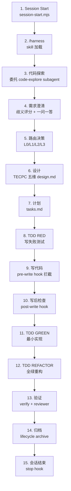

# Harness 全生命周期真相文档（闭环五检驱动）

> **用途**：本文档是 harness 的唯一时序真相。每一步标明：TECPC 维度、涉及文件、产出文件、预期输出、异常检测。**如果实际行为与本文档不符，就是 bug，应该提 issue。**

---

## 时序总览



---

## Step 1: Session Start（会话启动）

### TECPC 维度
- **T 目标**：让用户知道当前项目状态
- **C 上下文**：插件读取项目结构 + active change
- **E 证据**：输出闭环五检卡（TECPC 卡）
- **P 纠正**：告诉用户下一步该做什么

### 涉及文件
| 文件 | 角色 |
|------|------|
| `.claude/settings.json` | 注册 SessionStart hook |
| `harness/plugin/runtime/hooks/session-start.mjs` | 执行启动检查 |
| `harness/plugin/runtime/lib/status-summary.mjs` | 构建状态摘要 |
| `harness/plugin/runtime/lib/tecp-card.mjs` | 渲染 TECPC 卡 |
| `harness/project-info.json`（目标项目） | 项目技术栈 |
| `harness/ACTIVE_CHANGE`（目标项目） | 当前 change |

### 产出文件
无（纯 stdout 输出，不写文件）

### 预期输出
```
[Harness 启动检查] .claude/rules=存在 | .claude/agents=存在 | ...
[Harness 入口] 普通用户入口: /harness
[Harness 强制约束] 所有请求必须先走 /harness 进入 SOP，不得跳过。
[Harness 项目技术栈] language=java | buildTool=maven
[Harness 进度] 当前阶段: ...
[Harness Workflow] 当前 stage: clarify
[Harness 闭环五检]
┌─ your-change (L2) ─
│ T 目标    ▸ 模板支持硬删除
│ C 上下文  ▸ 缺少 requirements.md
│ E 证据    ▸ 尚无证据
│ P 路径    ▸ 涉及 API+数据，故 L2
│ P 纠正    ▸ /harness
│ Ladder
  ▸ clarify
  ○ route
  ○ design
  ...
└─
[Harness 工具提醒] 代码探索时请优先使用 codegraph_explore...
```

### 异常检测
| 现象 | 原因 | 处理 |
|------|------|------|
| 无任何 `[Harness ...]` 输出 | 插件未安装 | `plugin install` |
| 技术栈显示 `<...>` 未填写 | project-info.json 未配置 | 编辑 `harness/project-info.json` |
| 无 `[Harness 闭环五检]` | 无 active change 或 hook 异常 | `cli.mjs status` |
| TECPC 卡全显示"未记录" | state.json 缺 goal 字段 | 旧版本迁移自动补齐 |

---

## Step 2: /harness 加载

### TECPC 维度
- **T 目标**：识别用户意图，进入正确流程
- **C 上下文**：读取 active change 状态
- **P 路径**：决定走 clarify / 继续 / 恢复

### 涉及文件
| 文件 | 角色 |
|------|------|
| `.claude/skills/harness/SKILL.md` | 总入口行为定义 |
| `.claude/skills/harness-intake/SKILL.md` | clarify/route 子流程 |
| `harness/ACTIVE_CHANGE` | 当前 change 指针 |
| `harness/changes/*/state.json` | change 状态 |

### 产出文件
- 如果是新需求：后续会创建 `harness/changes/<change-id>/`
- 如果是继续：读取现有 change

### 预期行为
- Claude 识别到需求，说"让我先了解一下"
- 如果有 active change，显示当前阶段和缺口
- **不得跳过 clarify 直接写代码**

### 异常检测
| 现象 | 原因 | 处理 |
|------|------|------|
| Claude 直接写 Java 代码 | 跳过 /harness | 提 issue |
| Claude 不知道当前阶段 | skill 加载失败 | 提 issue |

---

## Step 3: 代码探索（委托 subagent）

### TECPC 维度
- **T 目标**：了解项目结构
- **C 上下文**：获取代码事实
- **E 证据**：subagent 返回的 exploration packet

### 涉及文件
| 文件 | 角色 |
|------|------|
| `.claude/agents/code-explore.md` | 代码探索 agent（定位 + 调用链 + 影响面） |
| `harness/plugin/runtime/hooks/pre-explore.mjs` | 探索门禁（Grep/Read/Glob 拦截） |
| `harness/explorations/` | 探索证据存放 |
| `harness/changes/<id>/evidence/tooling.md` | 工具使用证据 |

### 产出文件
- `harness/changes/<id>/evidence/tooling.md`（记录 codegraph 查询和发现）

### 预期行为
1. Claude 通过 **Agent 工具**派遣 `code-explore` subagent
2. subagent 的任务标题必须指向当前用户项目与具体探索主题，不得写成 `Explore enterprise-harness`
3. subagent 使用 `codegraph_explore` / `codegraph_search` 探索
4. subagent 返回结论后，主 orchestrator 应消费结论并基于事实继续推进，不得忽略结论后重新发起相同探索

### 异常检测
| 现象 | 原因 | 处理 |
|------|------|------|
| Claude 自己 grep/Read 搜索 | 未委托 subagent | 提 issue（#49/#50/#51 同类） |
| subagent 标题写成 `enterprise-harness` 或含 `enterprise-harness` | prompt 编排 bug | 提 issue |
| subagent 已返回结论但主 agent 忽略结论并重新探索 | subagent 通信/消费契约 bug | 提 issue |
| subagent 返回后 Claude 重新搜索 | 忽略了 subagent 结论 | 提 issue |
| subagent 未使用 codegraph | 弱模型限制 | 已知限制，低优先级 |

---

## Step 4: 需求澄清（歧义评分 + 一问一答）

### TECPC 维度
- **T 目标**：把模糊需求变明确
- **C 上下文**：基于探索事实提问
- **E 证据**：歧义评分表（7 维度 × 0-5 分）
- **P 路径**：针对 weakest dimension 提问

### 涉及文件
| 文件 | 角色 |
|------|------|
| `harness/specs/ambiguity-scoring.md` | 评分规则和标准 |
| `harness/changes/<id>/requirements.md` | 产出：TECPC 驱动的需求文档 |
| `harness/changes/<id>/state.json` | 更新 workflow.clarifyReady |
| `harness/changes/<id>/change.md` | 记录澄清过程 |

### 产出文件
- `harness/changes/<id>/requirements.md`（含 TECPC 评分表）
- `harness/changes/<id>/state.json`（更新 workflow 字段）

### 预期行为（每轮）
1. **展示评分表**：全维度分数 + overall + weakest + 评分依据
2. **用户确认/修正评分**
3. **只问一个问题**（针对 weakest dimension）
4. 问题用**选项式**（A/B/C + 其他）
5. 用户回答后**重新评分**，说明变化原因

### 预期输出示例
```
📊 歧义评分（第 2 轮）

| 维度 | 上轮 | 本轮 | 依据 |
|------|------|------|------|
| T 目标 | 2 | 3 | 用户确认删除范围为"整个模板+所有版本" |
| Scope | 1 | 2 | codegraph 发现了 5 张关联表 |
| E 证据 | 0 | 2 | 已探索模板模块代码结构 |
| ... | | | |

Overall: 2.4 → 2.7
Weakest: Interface/API clarity (2)
→ 下一个问题：硬删除后现有的软删除 DELETE 接口是否保留？

A. 保留两个接口（软删除 + 硬删除）
B. 替换现有接口为硬删除
C. 其他

请确认评分是否准确，或告诉我哪个维度需要调整。
```

### 异常检测
| 现象 | 原因 | 处理 |
|------|------|------|
| Claude 一次问 5 个问题 | 未遵守一问一答 | 提 issue（#51 同类） |
| 没有展示歧义评分 | 未遵守评分规则 | 提 issue（#51 同类） |
| 评分没有依据 | 凭空打分 | 提 issue |
| 用户说"这个分数不对"但 Claude 无视 | 未接受用户修正 | 提 issue |

---

## Step 5: 路由决策（L0/L1/L2/L3）

### TECPC 维度
- **T 目标**：确定变更复杂度
- **C 上下文**：基于 clarify 结果
- **E 证据**：tier 决策理由
- **P 路径**：选择 L0-L3

### 涉及文件
| 文件 | 角色 |
|------|------|
| `harness/changes/<id>/state.json` | 设置 tier + state + goal |
| `harness/changes/<id>/change.md` | 记录路由决策 |
| `harness/ACTIVE_CHANGE` | 设置 active change |

### 产出文件
- `harness/changes/<id>/state.json`（tier/state/goal/routingReason 有值）
- `harness/ACTIVE_CHANGE`（指向 change-id）

### 预期行为
- state.json 中 `tier` = L0/L1/L2/L3
- `goal` 有内容（不是 null）
- `routingReason` 有内容（说明为什么选这个 tier）

### 异常检测
| 现象 | 原因 | 处理 |
|------|------|------|
| tier 为空 | 路由决策未完成 | 提 issue |
| goal 为 null | scaffold 未设置 | 提 issue（v0.1.21+ 已修复） |
| ACTIVE_CHANGE 未设置 | 变更未创建 | 提 issue |

---

## Step 6: 设计（TECPC 五维 design.md）

### TECPC 维度
- **T 目标**：设计必须回答"要达成什么"
- **C 上下文**：必须基于探索事实
- **E 证据**：每个决策必须有证据来源
- **P 路径**：必须有方案对比 + 纠正预案

### 涉及文件
| 文件 | 角色 |
|------|------|
| `harness/templates/design.md` | TECPC 驱动的模板 |
| `harness/changes/<id>/design.md` | 产出：设计文档 |
| `.claude/skills/harness-design/SKILL.md` | design 阶段行为 |
| `.claude/agents/design-reviewer.md` | 设计审查（含 TECPC 门禁） |
| `harness/changes/<id>/reviews/design-reviewer.json` | reviewer verdict |

### 产出文件
- `harness/changes/<id>/design.md`（TECPC 五维完整）
- `harness/changes/<id>/reviews/design-reviewer.json`

### 预期行为
design.md 必须包含以下 TECPC section：

```
## T 目标
### 业务目标
### 成功标准

## C 上下文
### 当前状态（Evidence-based）
### 影响矩阵

## E 证据
### 设计决策依据
### 测试策略
### 验证命令

## P 路径
### 方案选择（对比表）
### 最终方案（接口/数据/架构设计）
### 风险与回滚
### P 纠正预案

## Design Self-Review
- [ ] T 目标明确且可验收
- [ ] C 上下文基于事实（非猜测）
- [ ] E 每个关键决策有证据
- [ ] P 路径清晰且有纠正预案
```

### design-reviewer TECPC 门禁
- T 目标不能是占位符（如"待补充"）
- C 上下文必须引用具体代码/文件/模块
- E 证据列必须有实际来源
- P 路径必须有"为什么不选其他方案"

### 异常检测
| 现象 | 原因 | 处理 |
|------|------|------|
| design.md 缺 T/C/E/P 任一 section | 模板未遵循 | 提 issue |
| T 目标写"待补充" | 占位符未填写 | design review 应 block |
| C 上下文只写"现有系统" | 未引用具体代码 | design review 应 block |
| E 证据列全空 | 决策无支撑 | design review 应 block |
| P 路径无方案对比 | 未做方案分析 | design review 应 block |
| 无纠正预案 | 缺恢复路径 | design review 应 block |
| pre-write 未 BLOCK 缺 design.md | 门禁失效 | 提 issue（v0.1.18+ 已修复） |

---

## Step 7: 计划（tasks.md）

### TECPC 维度
- **T 目标**：把设计拆成可执行任务
- **E 证据**：每个 task 有 RED/GREEN evidence point
- **P 路径**：实现顺序 + 文件列表

### 涉及文件
| 文件 | 角色 |
|------|------|
| `harness/changes/<id>/tasks.md` | 产出：任务列表 |
| `.claude/skills/harness-plan/SKILL.md` | plan 阶段行为 |
| `.claude/agents/plan-critic.md` | 计划审查 |
| `harness/changes/<id>/reviews/plan-critic.json` | plan critic verdict |

### 产出文件
- `harness/changes/<id>/tasks.md`（非 draft）
- `harness/changes/<id>/reviews/plan-critic.json`

### 预期行为
每个 task 必须包含：
- Touched files
- Implementation order
- Test-first order
- **RED evidence point**（哪个测试先失败）
- **GREEN evidence point**（哪个测试后通过）
- Acceptance checks

### 异常检测
| 现象 | 原因 | 处理 |
|------|------|------|
| tasks.md 仍是 draft | plan 未完成 | pre-write 会 BLOCK |
| 无 RED/GREEN evidence point | plan 不完整 | plan-critic 应 block |
| pre-write 未 BLOCK 缺 tasks.md | 门禁失效 | 提 issue（v0.1.18+ 已修复） |

---

## Step 8: TDD RED（写失败测试）

### TECPC 维度
- **E 证据**：测试先失败 = 问题存在的证据

### 涉及文件
| 文件 | 角色 |
|------|------|
| `src/test/java/**/*Test.java` | 测试文件 |
| `harness/changes/<id>/state.json` | 更新 workflow.tddStatus |

### 产出文件
- 测试文件（新创建）
- state.json `workflow.tddStatus` = `test-written` → `red-verified`

### 预期行为
- Claude 先写测试
- 运行测试，测试**失败**（exit 非 0）
- 这是 RED 证据

### 异常检测
| 现象 | 原因 | 处理 |
|------|------|------|
| 测试直接通过（没 RED） | 测试写得太松 | 提 issue |
| 没写测试直接改实现 | 跳过 RED | pre-write 门禁 + prompt 约束 |
| state.json tddStatus 未更新 | 状态未同步 | 提 issue |

---

## Step 9: 写入代码（pre-write hook 拦截）

### TECPC 维度
- **P 纠正**：如果前置条件不满足→BLOCK + TECPC 卡

### 涉及文件
| 文件 | 角色 |
|------|------|
| `harness/plugin/runtime/hooks/pre-write.mjs` | 12 道拦截 |
| `harness/plugin/runtime/lib/gates.mjs` | gate 检查逻辑 |
| `harness/plugin/runtime/lib/tecp-card.mjs` | BLOCK 时渲染 TECPC 卡 |

### 产出文件
无（拦截时不写文件）

### 12 道拦截（按顺序）
| # | 检查 | BLOCK 消息关键词 |
|---|------|-----------------|
| 1 | 写 legacy 目录 | `请不要继续把运行时规范写入历史目录` |
| 2 | 写 archive 目录 | `harness/archive/ 视为冻结历史` |
| 3 | 无 ACTIVE_CHANGE | `必须先设置且保持有效的 harness/ACTIVE_CHANGE` |
| 4 | state=DRAFT | `仍处于 DRAFT` |
| 5 | state=ARCHIVED/REJECTED | `处于 ARCHIVED/REJECTED` |
| 6 | clarify 缺产物 | `处于 clarify 阶段，缺少:` |
| 7 | route 缺 tier | `处于 route 阶段，tier 未设置` |
| 8 | design 缺 design.md | `处于 design 阶段，design.md 不存在` |
| 9 | plan 缺 tasks.md | `处于 plan 阶段，tasks.md 不存在` |
| 10 | codegraph 证据缺失 | `tooling.codegraph 仍为 unknown/空` |
| 11 | designApproved=false | `需要 designApproved=true` |
| 12 | RED 证据不足 | `需要 currentTask-scoped red verification` |

### 预期行为
- BLOCK 时：stderr 输出 BLOCK 消息 + TECPC 卡
- 通过时：exit 0

### 异常检测
| 现象 | 原因 | 处理 |
|------|------|------|
| 跳过 design 直接写代码但没被 BLOCK | 门禁失效 | 提 issue |
| BLOCK 消息没有 TECPC 卡 | 版本过旧 | 更新插件 |
| BLOCK 消息含 "reference-service" | 版本过旧（< 0.1.12） | 更新插件 |

---

## Step 10: 写后检查（post-write hook）

### TECPC 维度
- **E 证据**：检查 artifact 完整性 + OpenAPI 一致性

### 涉及文件
| 文件 | 角色 |
|------|------|
| `harness/plugin/runtime/hooks/post-write.mjs` | 写后检查 |
| `harness/plugin/runtime/lib/checks.mjs` | 检查逻辑 |

### 检查内容
1. artifact 完整性（change.md / validation.md / evidence/tooling.md）
2. OpenAPI 结构（任意 openapi/*.yaml）
3. **通用 OpenAPI ↔ Controller 一致性**（path + method 对齐）

### 异常检测
| 现象 | 原因 | 处理 |
|------|------|------|
| 写完代码后无 post-write 输出 | hook 未触发 | 提 issue |
| OpenAPI 与 Controller 不一致 | 契约漂移 | 按错误信息修复 |

---

## Step 11-12: TDD GREEN + REFACTOR

### TECPC 维度
- **E 证据**：测试通过 = 实现正确的证据
- **T 目标**：最小实现通过测试

### 产出文件
- state.json `workflow.tddStatus` = `green-verified` → `refactor-verified`

---

## Step 13: 验证（verify + reviewer）

### TECPC 维度
- **E 证据**：validation fresh + reviewer pass
- **P 纠正**：不通过则按 findings 修复

### 涉及文件
| 文件 | 角色 |
|------|------|
| `harness/plugin/runtime/verify.mjs` | 契约检查（含 TECPC 卡） |
| `.claude/agents/verification-reviewer.md` | 验证审查 |
| `harness/changes/<id>/validation.md` | 验证记录 |
| `harness/changes/<id>/reviews/verification-reviewer.json` | verdict |

### 预期行为
- `cli.mjs verify` 输出 `OK contract checks passed`
- `validation.status` = `fresh`
- verify 输出 TECPC 卡

### 异常检测
| 现象 | 原因 | 处理 |
|------|------|------|
| verify 报错 | 契约违反 | 按错误修复 |
| validation.status=stale | 验证未完成 | 重新验证 |
| verify 无 TECPC 卡 | 版本过旧 | 更新插件 |

---

## Step 14: 归档

### 涉及文件
| 文件 | 角色 |
|------|------|
| `harness/plugin/runtime/lifecycle.mjs` | `archive` 命令 |
| `harness/archive/` | 归档目标 |

### 前提条件
- state = VALIDATED
- validation.status = fresh
- 不被 smoke test 引用

### 预期行为
- `lifecycle archive <changeId>` 成功
- change 移入 `harness/archive/`

---

## Step 15: 会话结束（stop hook）

### TECPC 维度
- **P 纠正**：validation stale 时 BLOCK + TECPC 卡 + 恢复指引

### 涉及文件
| 文件 | 角色 |
|------|------|
| `harness/plugin/runtime/hooks/stop.mjs` | 停止前检查 |
| `harness/plugin/runtime/lib/tecp-card.mjs` | TECPC 卡 |

### 预期行为
- validation stale + state=VALIDATED/REVIEWED → BLOCK + TECPC 卡
- 正常放行 → stdout `{}`

### 异常检测
| 现象 | 原因 | 处理 |
|------|------|------|
| validation stale 未被拦截 | stop hook 失效 | 提 issue |
| BLOCK 无 TECPC 卡 | 版本过旧 | 更新插件 |

---

## TECPC 卡片格式参考

任何触发点（session-start / status / BLOCK / stop / verify）都输出同一张卡：

```
┌─ change-id (L2) ─
│ T 目标    ▸ 模板支持硬删除，级联清理关联数据
│ C 上下文  ▸ 已探索 7 表 | 已澄清 2 决策
│ E 证据    ▸ design approved | RED verified
│ P 路径    ▸ 涉及 API+数据，故 L2
│ P 纠正    ▸ /harness-plan
│ Ladder
  ✓ clarify
  ✓ route
  ▸ design
  ○ plan
  ○ tdd
  ○ verify
  ○ archive
└─
```

## 提 Issue 模板

```
### 问题层级
Repo contract / Bug / Feature

### 闭环五检维度（哪个断了？）
T 目标 / C 上下文 / E 证据 / P 路径 / P 纠正

### 你用的模型
/model 的输出

### 预期效果
对照上面的"预期输出"

### 实际效果
你实际看到的（粘贴输出）

### 证据
[粘贴上面对应的"异常检测"所需证据]

### 环境
- 插件版本：node -p "require('./package.json').version"
- 项目类型：Java/Maven? 其他?
```
