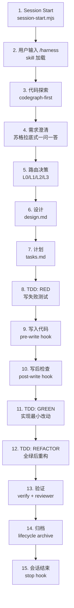

# Harness 全生命周期真相文档

> **用途**：本文档定义 harness 从会话开始到结束的完整时序流程。每一步都标明目标、涉及文件、产出、证据、checklist、预期行为。如果实际行为与本文档不符，就是 bug，应该提 issue。
>
> **维护原则**：当实现与本文档不一致时，要么修正实现，要么修正本文档。不允许出现"实现里有但文档没写"或"文档里写了但实现没做"的情况。

---

## 时序总览



---

## Step 1: Session Start（会话启动）

### 目标
检查 harness 环境是否就绪，输出项目状态摘要，让 Claude 一开始就了解上下文。

### 涉及文件
| 文件 | 角色 |
|------|------|
| `.claude/settings.json` | 定义 SessionStart hook 路径 |
| `harness/plugin/runtime/hooks/session-start.mjs` | 执行启动检查 |
| `harness/plugin/runtime/lib/checks.mjs` | 提供 `projectRoot()`/`exists()` 等工具函数 |
| `harness/plugin/runtime/lib/status-summary.mjs` | 构建状态摘要 |
| `harness/project-info.json`（目标项目） | 项目技术栈信息（新 v0.1.14） |
| `harness/ACTIVE_CHANGE`（目标项目） | 当前活跃 change 指针 |

### 产出
- 会话开头输出多行 `[Harness ...]` 标签文本（不写文件，只是 stdout）

### 证据
- 会话第一行或前几行应包含 `[Harness 启动检查]` 开头的输出

### Checklist
| 预期行为 | 如果没看到 |
|----------|-----------|
| `[Harness 启动检查] .claude/rules=存在 \| .claude/agents=存在 \| ...` | 插件没安装，重新 `plugin install` |
| `[Harness 项目技术栈] language=java \| buildTool=maven` | `harness/project-info.json` 未配置，运行 `setup-local-adapter --write` |
| `[Harness 工具提醒] 代码探索时请优先使用 codegraph_explore...` | session-start.mjs 被改坏 |
| `[Harness 经验] 高危教训 X 条` | `harness/changes/` 下有 lesson 记录 |

### 提 issue 条件
- 无任何 `[Harness ...]` 输出 → 插件安装问题
- 技术栈字段全显示 `<...>` 未填写 → 用户未编辑 project-info.json（不算 bug，但应提示）

---

## Step 2: 用户输入 /harness

### 目标
加载 `/harness` skill，进入 clarify-first staged workflow。

### 涉及文件
| 文件 | 角色 |
|------|------|
| `.claude/skills/harness/SKILL.md` | `/harness` 的完整行为定义 |
| `.claude/skills/harness-intake/SKILL.md` | clarify/route 子流程定义 |

### 产出
- Claude 应该识别到这是一个新需求（或继续已有 change）
- 如果是新需求，应该说类似"让我先了解一下你的需求"

### 证据
- 会话中应出现 Claude 对用户意图的确认或澄清提问

### Checklist
| 预期行为 | 如果没看到 |
|----------|-----------|
| Claude 知道要走 clarify-first 流程 | SKILL.md 加载失败，或模型完全无视 |
| Claude 说"让我先探索代码"或类似表述 | 模型跳过了探索步骤 |

### 提 issue 条件
- Claude 直接开始写 Java 代码，没有任何探索和澄清 → **不符合预期**

---

## Step 3: 代码探索（codegraph-first）

### 目标
在写任何代码之前，先了解目标项目的代码结构。

### 涉及文件
| 文件 | 角色 |
|------|------|
| `.claude/agents/code-explore.md` | 探索 agent 定义（含 codegraph MCP 工具列表） |
| `.claude/agents/impact-explore.md` | 影响面探索 agent |
| MCP: `codegraph_explore` / `codegraph_search` | 代码图谱查询工具 |

### 产出
- Claude 调用 `codegraph_explore` 或 `codegraph_search`（在会话日志中可见）
- 或者用 grep/Read 作为 fallback（必须在 evidence/tooling.md 里记录 fallback 原因）
- subagent 的任务标题必须指向当前用户项目与具体探索主题，不得写成 `Explore enterprise-harness`
- subagent 返回结论后，主 orchestrator 应消费结论并基于事实继续推进，不得忽略结论后重新发起相同探索

### 证据
- 会话日志中应有 `codegraph_explore` 或 `codegraph_search` 的调用记录
- 如果没有，至少应有明确的 fallback 原因记录

### Checklist
| 预期行为 | 如果没看到 |
|----------|-----------|
| Claude 调用了 `codegraph_explore` / `codegraph_search` | 弱模型可能跳过（已知限制，见下方说明） |
| 调用了 `codegraph_callers` / `codegraph_callees` / `codegraph_impact`（如果需要分析影响面） | 影响分析可能不完整 |
| subagent 标题不包含 `enterprise-harness` / `this repo` | 主 orchestrator prompt 编排 bug |
| 主 agent 基于 subagent 结论推进，而不是重复探索 | subagent 通信/消费契约 bug |

### 弱模型限制说明
v0.1.13+ 已在 agent 定义和 skill 里加了强制性 "codegraph-first" 指令，session-start.mjs 也在开头输出工具提醒。但对于 MiniMax-M2.7 等弱模型，prompt 级约束可能被完全无视。这是**已知的架构限制**，不是代码 bug。根本解法是程序级拦截（如 post-write 检查 evidence/tooling.md），留作后续增强。

### 提 issue 条件
- 强模型（Claude Opus/Sonnet）没有用 codegraph → **不符合预期**，请提 issue
- 弱模型没有用 codegraph → 已知限制，可提 issue 但优先级低
- subagent 标题写成 `enterprise-harness` 或 `Explore this repo` → 主 orchestrator 编排问题，请提 issue
- subagent 已返回结论但主 agent 忽略结论并重新探索 → subagent 通信/消费契约问题，请提 issue

---

## Step 4: 需求澄清

### 目标
一次问一个问题，逐步把歧义降到最低。

### 涉及文件
| 文件 | 角色 |
|------|------|
| `.claude/skills/harness-intake/SKILL.md` | clarify 子流程定义（"一次只问一个高价值问题"） |
| `harness/specs/ambiguity-scoring.md` | 歧义评分规则 |

### 产出
- Claude 应该向用户提问
- 问题应该是选项式的（A/B/C + 其他），不是开放式
- 最终应该形成一个"已确认执行范围"

### 证据
- 会话中应出现至少一个向用户的问题
- 用户回答后，Claude 应确认"已确认：..."

### Checklist
| 预期行为 | 如果没看到 |
|----------|-----------|
| Claude 一次只问一个问题 | 弱模型可能跳过，或一次问多个 |
| 问题用选项式（A/B/C + 其他） | 质量低但不算严重问题 |
| 用户回答后，Claude 确认理解 | 需求可能没被正确消化 |

### 提 issue 条件
- Claude 从头到尾没有向用户提过任何问题 → **不符合预期**

---

## Step 5: 路由决策（L0/L1/L2/L3）

### 目标
确定变更的复杂度 tier，影响后续需要走多少步骤。

### 涉及文件
| 文件 | 角色 |
|------|------|
| `.claude/skills/harness-intake/SKILL.md` | route 阶段定义 |
| `harness/changes/<change-id>/state.json` | 创建/更新 tier 字段 |

### 产出
- `state.json` 中的 `tier` 字段被设置（L0/L1/L2/L3）
- 变更目录被创建（如果还没有的话）

### 证据
- `state.json` 中 `tier` 字段有值
- `harness/ACTIVE_CHANGE` 指向该 change

### Checklist
| 预期行为 | 如果没看到 |
|----------|-----------|
| `harness/changes/<change-id>/state.json` 存在 | 变更目录未创建 |
| `state.json` 中有合理的 `tier` 值 | 模型没有做路由决策 |
| `harness/ACTIVE_CHANGE` 指向该 change | active change 未设置 |

### 提 issue 条件
- Claude 直接写代码，从未创建 `harness/changes/` 目录 → **不符合预期**

---

## Step 6: 设计（design.md）

### 目标
在写代码之前，先产出设计文档。

### 涉及文件
| 文件 | 角色 |
|------|------|
| `.claude/skills/harness-design/SKILL.md` | design 阶段定义 |
| `harness/changes/<change-id>/design.md` | 产出文件 |
| `.claude/agents/design-reviewer.md` | design reviewer agent |

### 产出
- `harness/changes/<change-id>/design.md` 被创建，按 TECP 四维组织：T 目标（业务目标+成功标准）、C 上下文（探索事实+影响矩阵）、E 证据（决策依据+测试策略+验证命令）、P 路径（方案对比+接口/数据/架构设计+风险回滚+纠正预案）

### 证据
- 文件系统上存在 `design.md`
- `state.json` 的 `approvals.design.status` 应该有值（pass/block/advisory）

### Checklist
| 预期行为 | 如果没看到 |
|----------|-----------|
| `design.md` 存在且 TECP 四维（T 目标/C 上下文/E 证据/P 路径）均有实质内容 | Claude 跳过了设计阶段或内容不完整 |
| `design.md` 含纠正预案（P 纠正） | 设计缺少恢复路径 |
| `reviews/design-reviewer.json` 存在 | reviewer 没有运行 |

### 提 issue 条件
- Claude 直接开始写 Java 代码，从未创建 `design.md` → **不符合预期**

---

## Step 7: 计划（tasks.md）

### 目标
把设计拆成可机械执行的任务切片。

### 涉及文件
| 文件 | 角色 |
|------|------|
| `.claude/skills/harness-plan/SKILL.md` | plan 阶段定义 |
| `harness/changes/<change-id>/tasks.md` | 产出文件 |
| `.claude/agents/plan-critic.md` | plan critic agent |

### 产出
- `tasks.md` 被创建，包含每个 task 的 touched files、RED/GREEN evidence point、验收标准
- `reviews/plan-critic.json` 记录 plan critic verdict

### 证据
- 文件系统上存在 `tasks.md`，内容不为空
- `state.json` 的 `gates.designApproved` 为 true

### Checklist
| 预期行为 | 如果没看到 |
|----------|-----------|
| `tasks.md` 存在且包含 RED/GREEN evidence point | plan 不完整 |
| `reviews/plan-critic.json` 存在 | plan critic 没有运行 |
| `state.json` 中 `gates.designApproved = true` | design 还没被 approve |

### 提 issue 条件
- tasks.md 存在但没有任何 RED/GREEN evidence point → **不符合预期**

---

## Step 8: TDD - RED（写失败测试）

### 目标
先写会失败的测试，证明问题存在。

### 涉及文件
| 文件 | 角色 |
|------|------|
| `.claude/skills/harness-tdd/SKILL.md` | TDD 阶段定义 |
| `harness/changes/<change-id>/state.json` | 记录 `workflow.tddStatus: test-written` |

### 产出
- 测试文件被创建
- 运行测试，测试失败（exit 非 0）
- `state.json` 中 `workflow.tddStatus` 更新

### 证据
- 测试文件存在
- 测试运行输出包含失败信息
- `state.json` 中 `workflow.tddStatus` 为 `test-written` 或 `red-verified`

### Checklist
| 预期行为 | 如果没看到 |
|----------|-----------|
| 测试文件被创建 | 没写测试 |
| 测试运行后失败 | 测试写得太松（永远通过） |
| `state.json` 中 `workflow.tddStatus` 已更新 | 状态没同步 |

### 提 issue 条件
- Claude 声称"RED 验证通过"但测试实际上没有失败 → **不符合预期**

---

## Step 9: 写入代码（pre-write hook 拦截）

### 目标
在 Claude 修改受治理路径下的文件时，机械门禁检查是否满足前提条件。

### 涉及文件
| 文件 | 角色 |
|------|------|
| `.claude/settings.json` | 定义 PreToolUse hook |
| `harness/plugin/runtime/hooks/pre-write.mjs` | 执行拦截检查 |
| `harness/plugin/runtime/lib/gates.mjs` | `isGovernedTarget`/`requiredGateForTarget` |
| `harness/plugin/runtime/lib/checks.mjs` | `loadActiveChange` |

### 拦截逻辑
```
写入文件路径 → isGovernedTarget 判断是否为 src/main/java|src/test/java|openapi
  ├─ 是受治理路径 → 检查 ACTIVE_CHANGE → 检查 state → 检查 designApproved → 检查 RED 证据
  │   ├─ 任一检查失败 → BLOCK（exit 2）
  │   └─ 全部通过 → 允许写入
  └─ 不是受治理路径 → 允许写入（可能有 REMINDER）
```

### 证据
- 如果被 BLOCK：stderr 有 `BLOCK: ...` 输出
- 如果允许：pre-write hook 以 exit 0 结束

### 6 个 BLOCK 条件
| 条件 | 错误信息 |
|------|---------|
| ACTIVE_CHANGE 缺失 | `BLOCK: 修改受治理路径...必须先设置 ACTIVE_CHANGE` |
| state=DRAFT | `BLOCK: 当前 active change 仍处于 DRAFT` |
| state=ARCHIVED/REJECTED | `BLOCK: 当前 active change 处于 ARCHIVED/REJECTED` |
| designApproved=false | `BLOCK: 当前目标路径需要 designApproved=true` |
| RED 证据不足 | `BLOCK: 当前目标路径需要 currentTask-scoped red verification` |
| legacy 路径写入 | `BLOCK: 请不要继续把运行时规范写入历史目录` |

### Checklist
| 预期行为 | 如果没看到 |
|----------|-----------|
| 写 `src/main/java` 路径时被正确拦截或放行 | hook 没触发 |
| BLOCK 信息不含"reference-service"字样 | 插件版本过旧（< 0.1.12） |
| 非受治理路径的 `.java` 文件输出 REMINDER | REMINDER 功能缺失 |

### 提 issue 条件
- 写 `src/main/java` 但没被拦截，且 state.json 中 `designApproved=false` → **不符合预期**
- BLOCK 信息里有"reference-service" → 版本太旧，更新后如果仍有则提 issue

---

## Step 10: 写后检查（post-write hook）

### 目标
在代码写入后，检查变更资产完整性和 OpenAPI 结构。

### 涉及文件
| 文件 | 角色 |
|------|------|
| `.claude/settings.json` | 定义 PostToolUse hook |
| `harness/plugin/runtime/hooks/post-write.mjs` | 执行后检查 |
| `harness/plugin/runtime/lib/checks.mjs` | `validateStructure`/`validateArtifactStates`/`validateOpenApiLight` 等 |

### 检查逻辑
```
1. validateStructure（仅 isHarnessManaged 时）
2. validateArtifactStates/validateReviewVerdicts/validateChangeEvidence（仅 hasChangeTracking 时）
3. validateOpenApiLight（任意 openapi 目录）
4. validateGenericControllerConsistency（任意 openapi + *Controller.java）
5. validateReferenceServiceControllerConsistency（reference-service demo 自检）
```

### 证据
- 如果发现问题：stderr 有错误信息，exit 1
- 如果通过：stdout 有 `Post-write gate passed` 输出

### Checklist
| 预期行为 | 如果没看到 |
|----------|-----------|
| 写完代码后有 `Post-write gate passed` 输出 | post-write hook 没触发或发现了问题 |
| 如果缺少 `change.md`/`validation.md`/`evidence/tooling.md`，报错 | post-write hook 没有检查 artifact 完整性 |

### 提 issue 条件
- 写完代码后没有任何 post-write hook 输出 → hook 没触发，提 issue

---

## Step 11: TDD - GREEN（实现最小改动）

### 目标
写最小实现让测试通过。

### 涉及文件
| 文件 | 角色 |
|------|------|
| `harness/changes/<change-id>/state.json` | 更新 `workflow.tddStatus: green-verified` |

### 产出
- 测试文件运行成功（exit 0）
- `state.json` 中 `workflow.tddStatus` 更新为 `green-verified`

### Checklist
| 预期行为 | 如果没看到 |
|----------|-----------|
| 测试运行通过 | 实现不完整 |
| `state.json` 中 `workflow.tddStatus = green-verified` | 状态没同步 |

---

## Step 12: TDD - REFACTOR

### 目标
全绿后重构代码。

### 涉及文件
| 文件 | 角色 |
|------|------|
| `harness/changes/<change-id>/state.json` | 更新 `workflow.tddStatus: refactor-verified` |

### Checklist
| 预期行为 | 如果没看到 |
|----------|-----------|
| 全绿后才做重构 | 过早重构 |
| 重构后测试仍全绿 | 重构破坏了功能 |

---

## Step 13: 验证（verify）

### 目标
消费 reviewer verdict 和 validation freshness，确认完成态。

### 涉及文件
| 文件 | 角色 |
|------|------|
| `.claude/skills/harness-verify/SKILL.md` | verify 阶段定义 |
| `.claude/agents/verification-reviewer.md` | verification reviewer |
| `harness/changes/<change-id>/validation.md` | 验证记录 |
| `harness/changes/<change-id>/reviews/verification-reviewer.json` | reviewer verdict |
| `harness/plugin/runtime/verify.mjs` | 结构/契约检查入口 |

### 产出
- `validation.md` 被创建/更新
- `reviews/verification-reviewer.json` 记录 verdict（pass/block）
- `state.json` 中 `validation.status` 变为 `fresh`

### 证据
- `cli.mjs verify` 输出 `OK contract checks passed`
- `reviews/verification-reviewer.json` 的 `verdict` 为 `pass`

### Checklist
| 预期行为 | 如果没看到 |
|----------|-----------|
| `cli.mjs verify` 通过 | 存在 contract violation |
| `verification-reviewer.json` verdict 为 pass | reviewer 判定不通过 |
| `state.json` 中 `validation.status = fresh` | 验证没完成 |

### 提 issue 条件
- `cli.mjs verify` 报出非 `validation.status` 相关的错误 → 可能是代码 bug

---

## Step 14: 归档

### 目标
把已完成的 change 物理移动到 `harness/archive/`。

### 涉及文件
| 文件 | 角色 |
|------|------|
| `harness/plugin/runtime/lifecycle.mjs` | `cmdArchive` 函数 |
| `harness/plugin/runtime/hooks/stop.mjs` | 检查是否还有未完成的 change |

### 归档前提条件
- `state.json` 的 `state` 必须为 `VALIDATED`
- 不被任何 `harness/plugin/runtime/test/*.mjs` 文件引用（`isReferencedByTests`）
- `validation.status` 必须为 `fresh`

### 证据
- `harness/changes/<change-id>/` 目录不存在
- `harness/archive/<change-id>/` 目录存在

### Checklist
| 预期行为 | 如果没看到 |
|----------|-----------|
| `lifecycle archive <id>` 成功，输出 `Archived:` | 有未满足的前提条件 |
| archive 后 `harness/changes/` 下无该目录 | 物理移动失败 |
| archive 后 `cli.mjs verify` 仍全绿 | 归档过程引入了新问题 |

### 提 issue 条件
- `VALIDATED` 的 change 无法归档，且错误信息不是"被 test 引用" → **不符合预期**

---

## Step 15: 会话结束（stop hook）

### 目标
防止"伪完成"——带着过期验证数据假装完成。

### 涉及文件
| 文件 | 角色 |
|------|------|
| `.claude/settings.json` | 定义 Stop hook |
| `harness/plugin/runtime/hooks/stop.mjs` | 执行停止前检查 |

### 拦截条件
| 条件 | 错误信息 |
|------|---------|
| `validation.status != fresh` 且 state 为 VALIDATED/REVIEWED | `BLOCK: ... validation.status=stale` |
| 缺少 `validation.md` | `BLOCK: ... 缺少 validation.md` |
| reviewer verdict 不满足 | `BLOCK: ... reviewer verdict 未满足完成态要求` |

### Checklist
| 预期行为 | 如果没看到 |
|----------|-----------|
| 如果验证未完成，stop hook 拦截 | hook 没触发 |
| 如果验证已完成，stop hook 正常放行 | 正常行为 |

### 提 issue 条件
- 验证明显未完成但 stop hook 没拦截 → **不符合预期**
- 验证已完成但 stop hook 错误拦截 → **不符合预期**

---

## 提 Issue 模板

当实际行为与上述检查清单不符时，请按以下格式提 issue：

```
### 问题层级
Repo contract / Bug / Feature

### 问题描述
[你看到了什么，不符合哪个 Step 的预期]

### 复现步骤
1. 模型：[用 /model 查看，如 Claude Sonnet 5 / MiniMax-M2.7]
2. 项目：[什么类型的项目，Java/Maven？]
3. 操作：[输入了什么命令]
4. 实际输出：[粘贴具体文本]
5. 期望输出：[对照上方对应 Step 的"应该看到"]

### 环境信息
- 插件版本：[node -p "require('./package.json').version"]
- harness/project-info.json 是否配置：[是/否]
```
