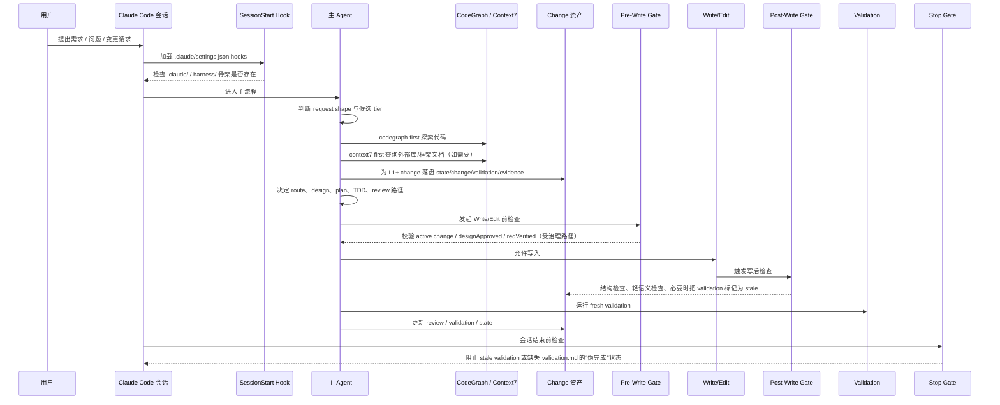

# Enterprise Harness 项目概览

## 一句话介绍

Enterprise Harness 是一套围绕 **Claude Code** 的企业后端交付骨架。

它的目标不是证明“模型会写代码”，而是把一次需求从聊天输入，推进为**可探索、可落盘、可审查、可验证、可恢复**的工程过程。

> **普通用户 30 秒开始：**
> 1. 安装 `enterprise-harness`
> 2. 打开 Claude Code
> 3. 输入 `/harness`
>
> 其余 runtime / maintainer 能力都不是普通用户前门。

---

## 这个项目解决什么问题

很多团队在使用 Claude Code 时，会遇到几类典型问题：

- 会话里说过的话，下一轮就丢了
- 模型容易直接开写，跳过设计、TDD 和验证
- 代码探索、外部文档查询、变更资产、评审结论分散在不同地方
- 换一台机器、换一个系统后，本地运行方式不一致
- 项目规则写了很多，但没有真正接进运行时门禁
- 用户视角下入口太多，SOP 容易被破坏

Enterprise Harness 的思路是把这些问题拆成两层：

1. **Repo Contract**：团队共享的仓库契约
2. **Portable Runtime**：每台机器本地适配的运行层

这样，团队共享的是规则、结构和语义；本地适配的是路径、工具、shell、环境变量和 secrets。

---

## 当前项目包含什么

### 1. Repo Contract（仓库共享契约）

由仓库提交和共享：

- `CLAUDE.md`：项目短地图与操作合同
- `.claude/rules/`：自动加载规则
- `.claude/agents/`：reviewer / subagent 骨架
- `.claude/skills/`：项目 skill
- `harness/specs/`：长期稳定规范
- `harness/templates/`：change / design / tasks / validation 等模板
- `harness/changes/`：活动 change 资产
- `harness/config.yaml`：能力声明与策略配置

### 2. Portable Runtime（跨平台运行层）

由每台机器自行适配，主要服务于：

- plugin / repo 的后台运行
- maintainer / operator 的低层控制
- hooks、doctor、sync、verify 等 runtime contract 消费

普通用户不把它当成前门；对用户真正暴露的工作流入口仍然是 `/harness`。

---

## 一个请求过来，这套 Harness 会发生什么

下面的时序图描述的是**当前仓库已经实现的主流程**。其中部分 gate 只对受治理路径生效，特别是 `reference-service/`。

---

## 这个流程里，哪些事情是已经落地的

### 已经落地

- `.claude/settings.json` 已接上 `SessionStart` / `PreToolUse` / `PostToolUse` / `Stop` hooks
- `codegraph-first` 已经是真实可用的主路径
- `Context7` 已有 CLI wrapper 路径
- `harness/changes/`、`state.json`、`validation.md`、`evidence/tooling.md` 已形成最小 change 资产模型
- `reference-service/` 受治理路径已经接入 pre-write gate
- `doctor` / `sync` / `verify` / `upstream-check` 已有统一 CLI 入口
- GitHub Actions `platform-smoke` 已在 Linux / macOS / Windows 运行 smoke test

### 还在建设中

- 更完整的 plan gate / task gate
- 更细粒度的 `RED_VERIFIED` 消费逻辑
- ArchUnit
- JaCoCo 85% 机械门禁
- 真实 HTTP API E2E
- 更强的 OpenAPI 语义门禁
- 更完整的 installer / upgrade / migration 体验
- 更广泛的真机开发机场景验证

---

## 当前对“门禁”的准确理解

不要把当前项目理解成“所有文件、所有路径、所有流程都已经被强门禁接管”。

更准确的说法是：

- **共享契约层**已经比较清楚
- **运行时入口**已经统一到 Node CLI
- **关键治理路径**已经开始真实拦截
- **完整企业门禁**仍处于 MVP 向更强平台迭代的阶段

尤其是：

- `reference-service/src/main`
- `reference-service/src/test`
- `reference-service/openapi`

这些路径的治理最严格；其他文档和 runtime 骨架路径，目前更多依赖结构检查与流程约束，而不是同等强度的业务 gate。

---

## 你最应该知道的几个目录

### 高层入口
- `README.md`
- `PROGRESS.md`
- `CLAUDE.md`
- `harness/specs/staged-workflow.md`

### 自动加载入口
- `.claude/settings.json`
- `.claude/rules/`
- `.claude/agents/`（含 reviewer 与 exploration worker）
- `.claude/skills/`

### 变更与资产
- `harness/changes/`
- `harness/templates/`
- `harness/specs/`
- `harness/explorations/`
- `harness/ACTIVE_CHANGE`

### 跨平台运行层
- `harness/plugin/runtime/cli.mjs`
- `harness/plugin/runtime/doctor.mjs`
- `harness/plugin/runtime/sync.mjs`
- `harness/plugin/runtime/verify.mjs`
- `harness/plugin/runtime/hooks/*.mjs`

### Java 参考样板
- `reference-service/`

---

## 适合谁

当前版本最适合：

- 想把 Claude Code 用在 **Java 后端 / Spring Boot** 团队流程里的人
- 想把“聊天式写代码”收敛为“有状态、有证据、有门禁”的团队
- 想把项目共享规范与机器本地适配拆开的团队
- 想基于现有骨架继续做企业化迭代的人

它当前不适合作为：

- 已宣称完整安装产品的一键式插件
- 已完全替代企业 CI/CD 与质量平台的终态系统
- 前端 UI 点击测试框架

---

## 当前状态的最准表述

> **已具备 Claude Code 本地 marketplace 可安装/可更新路径的 repo contract + portable runtime MVP。**

也就是说，它已经不只是一个“clone 后手动跑脚本”的仓库骨架，而是：

- 可以通过 Claude Code plugin marketplace add / install / update 走本地 marketplace 安装路径
- 对用户的正常工作流入口严格收口为**唯一前门 `/harness`**
- clone + direct CLI 只保留为 fallback / development path
- 但还不是已经公开发布到官方/公共 marketplace 的终态产品

---

## 继续阅读

- [项目公告文案](./announcement.md)
- [安装教程](./installation-guide.md)
- [维护 / 排障指南](./maintainer-runtime-guide.md)
- `README.md`
- `PROGRESS.md`
- `CLAUDE.md`
- `harness/specs/session-lifecycle.md`
- `harness/specs/staged-workflow.md`
- `harness/specs/plugin-runtime.md`
- `harness/specs/platform-validation-matrix.md`
