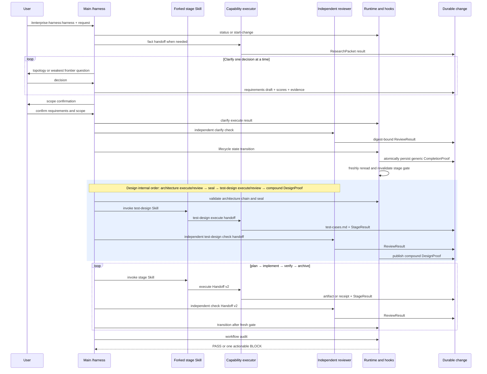

# 阶段时序、事件与产物合同

本文件说明如何不依赖聊天，只用 state、artifact、Handoff v2 result、独立 review 和 receipt
判断实际执行。阶段与必要 artifact 的唯一机器真相是 `runtime/lib/stage-contract.mjs`。

## 总体时序



## 角色边界

| 角色 | 上下文 | 允许 | 禁止 |
|---|---|---|---|
| Main `/harness` | 用户主对话 | 创建/恢复 change；Clarify；用户决策；合法 transition | 直接探索业务代码、实现、替 reviewer 判定或替用户确认 |
| design/plan/verify/archive Skill | forked stage context | 消费 frozen handoff；生成当前 stage artifact 与 self-check | 用户交互、自我批准、读取无关对话 |
| implement Skill | 隔离 worktree + forked context | 按 task strategy/write scope/exact argv 实现并生成 receipt | 越界写入、自报命令证据、自我批准 |
| fact agent | 隔离 context | CodeGraph/Context7-first ResearchPacket | 产品决策、产品代码写入、用户采访 |
| reviewer | 与 executor 不同的独立 run | 消费 frozen artifact/result/rubric，返回 ReviewResult | 读取 executor transcript、修改 candidate、替用户决策 |
| Runtime/hooks | 宿主边界 | schema、digest、receipt、binding、transition 和 ledger gate | 需求分析或第二套 workflow |

## Handoff v2 闭环

每个 execute/check 行为至少留下：

1. `runs/<execute-run>/input.json`：stage、behavior、agent、inputRefs/inputDigests、TECPC target。
2. capability agent binding 与 ledger start/stop；code-explore 还需 CodeGraph attempt。
3. `runs/<execute-run>/result.json`：schema-valid StageResult 或 task result，绑定输入和 artifact digest。
4. `runs/<check-run>/input.json`：不同 runId、`parentRunId` 指向 execute run。
5. `runs/<check-run>/check.json`：独立 ReviewResult、rubricIds、reviewed digest 与 TECPC。
6. persisted generic CompletionProof：只有结构、独立性、agent binding 和 freshness 均有效才成立；只读 gate 不生成 proof。Clarify 的 `tecpc-complete` 还必须证明 assertion evidence 被 canonical artifact 或 TECPC envelope 覆盖，使 candidate proof 可派生。

Artifact 一旦修改，旧 result、review 和 completion evidence 自然 stale；不得靠 state boolean 恢复。

## 六阶段矩阵

| Stage | 必要 durable artifact/state | Executor | 独立检查 | 合法推进条件 |
|---|---|---|---|---|
| clarify | `requirements.md`、`classification.json`、`debt-assessment.json`、`project-contract-assessment.json`、immutable `clarify-decision-snapshot.json`；适用 ResearchPacket | Main（用户循环）+ fact agents | 不同 trusted identity/run 的 reviewer，绑定五项 canonical artifact | 五项 artifact、StageResult、独立 passing ReviewResult 与完整 TECPC 均 fresh；transition command 随后持久化并重验 generic CompletionProof |
| design | `design.md`、sealed ArchitectureProof、`test-cases.md`、compound `DesignProof` | artifact-worker architecture Skill + isolated test-design worker | distinct architecture and test-design reviews | architecture execute/review → seal → test-design execute/review ordered, all assertions/TECPC/digests fresh, runtime publishes compound proof |
| plan | `tasks.md`、current `test-cases.md` and compound `DesignProof` | artifact-worker + plan Skill | reviewer plan rubric | tasks/strategy/exact argv/write scope and `TC*` mappings frozen，result/review fresh |
| implement | `currentTask`；task receipts；产品变更 | implementer + implement Skill | reviewer task rubrics | 每 task receipt/self-check/review fresh，write scope 合规 |
| verify | `validation.md`；`validation.status=fresh`；current test cases and canonical TC receipts | artifact-worker + verify Skill | reviewer final rubrics | frozen argv 全执行；every accepted `TC*` has allowed status/receipt, critical E2E executed, validation、final review 和 completion fresh |
| archive | immutable archive manifest/attestation + current test cases/proofs | artifact-worker + archive Skill | reviewer archive rubric | manifest binds DesignProof/test cases/test-design chain/Verify receipts, writer attestation and CompletionProof are fresh |

Classification 是 clarify artifact；execution strategy 是 implement task 属性。没有 `route` 或 `tdd`
lifecycle stage。Clarify 只能通过 lifecycle state command 推进；该命令写入并重新读取 CompletionProof 后才 CAS 更新 stage。
`workflow status`、`workflow audit` 和旧的 `confirm-scope` decision 都不会生成 proof 或绕过此 gate。

## 诊断入口

```bash
enterprise-harness workflow status <change-id> --json
enterprise-harness workflow audit <change-id> --json
enterprise-harness trace <run-id> <change-id>
enterprise-harness trace --change <change-id> --mermaid
```

- `status=blocked` 且顶层 `nextAction` 不等于当前 `nextEntry`：只执行该 pre-entry recovery，不使用投影字段猜测下一阶段。
- `nextAction=/harness` 是当前入口标记；nested Clarify recovery/transition readiness 由 controller snapshot 路由，不形成自指 recovery。
- 非阻断状态：用户 Decision 只允许 `pendingDecision.options`；stage transition 必须由对应 readiness 与 lifecycle command 授权。
- audit 返回 0：已完成阶段的 state/artifact/result/review/digest 合同通过。
- audit 返回 2：按最早 blocker 的 recovery 修复，不手工编辑 state。
- trace 只渲染真实 ledger/runs，不绘制理想化的“应该发生”。

## 自动防漂移

| 测试 | 防止 |
|---|---|
| `harness-standard-skill-smoke` | Harness 方法、模板、eval 和上游追溯再次割裂 |
| `clarify-stage-contract-smoke` | 低分、无依据、未确认或高风险 requirements 被 finalizer 放行 |
| `workflow-audit-v6-result-smoke` | result/review/freshness 缺口被 state 投影掩盖 |
| `lifecycle-clarify-transition-smoke` | 未完成 Clarify gate 就进入 Design |
| `trace-mermaid-smoke` | 时序输出脱离真实 ledger |

发布前至少运行直接行为测试与 `npm run quality:local`；后者统一覆盖 prepublish、plugin validation、external-project E2E 和 artifact 内容检查。
