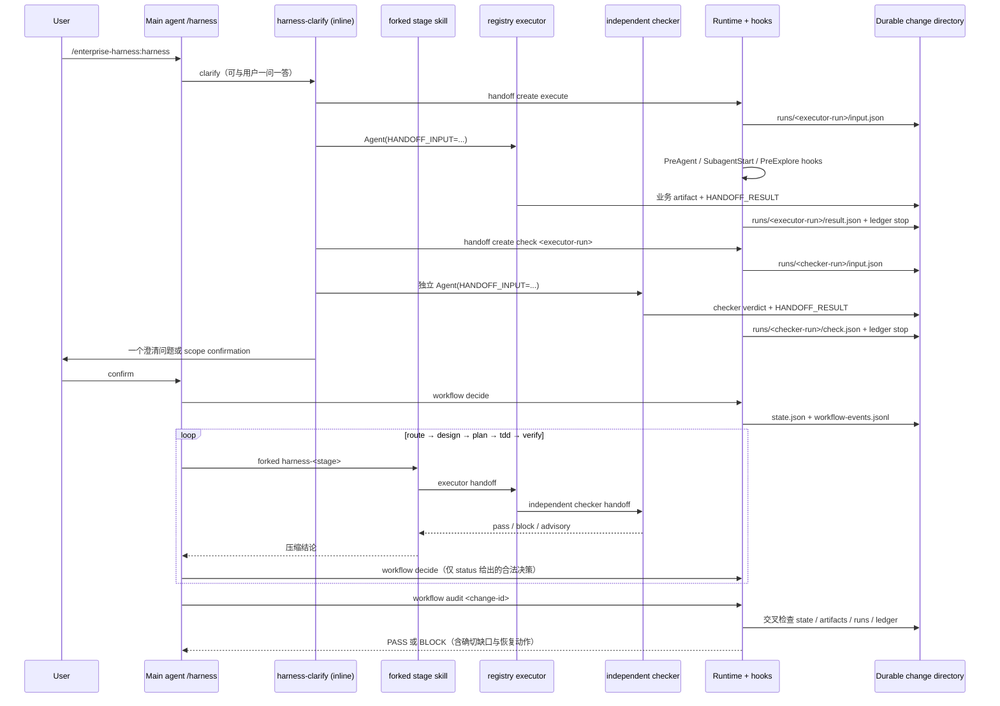

# 阶段时序、事件与产物合同

本文件回答四个可验证的问题：

1. 一个阶段是谁执行的：主对话、forked stage skill、executor，还是独立 checker？
2. 此阶段成功后磁盘上必须出现什么 durable artifact？
3. 哪些 hook/ledger/run 事件必须可追溯？
4. 如何不依赖聊天、只用本地证据判断实际执行是否符合预期？

唯一机器真相源是 `runtime/lib/stage-contract.mjs`。`workflow audit` 消费该合同、
`state.json`、change 内 artifact、`runs/*` handoff 结果和 git-common-dir receipt ledger；
不把聊天文字或单独的 state 投影当作通过证据。

## 总体时序



## 角色边界

| 角色 | 所在上下文 | 可以做什么 | 不可以做什么 |
|---|---|---|---|
| Main agent `/harness` | 用户主对话 | 创建/恢复 change；展示 evidence；询问 scope/route 确认；执行合法 `workflow decide` | 直接做代码探索、实现、代替 checker verdict |
| `harness-clarify` | 主对话 inline | 一次问一个问题；展示七维评分；安排探索与 synthesis/check | 自行代替用户确认 scope |
| route/design/plan/tdd/verify skill | `context: fork` | 读取最小 handoff；安排 executor 与 checker；返回压缩结论 | 直接获得用户确认；executor 自审 |
| registry executor | 独立 subagent | 按 input.json 做一个 behavior；写业务 artifact；输出 TECPC result | 自审；跳过 HANDOFF_RESULT |
| registry checker | 与 executor 不同的独立 run | 只消费 executor result/artifact；输出 pass/block/advisory | 重做 executor 工作；直接实现 |
| Runtime/hooks | 每次工具事件 | 机械 gate、记录 receipt、验证 handoff、标 stale、给 recovery | 需求分析或替模型作产品决定 |

## 每次 governed subagent 的事件与文件

下面是一个 executor/checker 闭环的固定最小集合；每个 behavior 都一样，差异只在
`behavior`、agent type、输出 artifact。

| 顺序 | 触发者 | Durable 事件 / 文件 | 失败时 |
|---|---|---|---|
| 1 | main/stage skill | `handoff create … execute` → `runs/<execute-run>/input.json` | 输入缺 behavior/stage/target/refs 时 BLOCK |
| 2 | PreToolUse:Agent | ledger `dispatch`（runId、behavior、agent、input path） | 没有 `HANDOFF_INPUT` 或 agent/stage 不匹配时 BLOCK |
| 3 | SubagentStart | ledger `start` | 输入损坏时 BLOCK |
| 4 | code-explore only | ledger `codegraph-attempt` | fallback 前同 agent 没有 attempt 时 BLOCK |
| 5 | executor | change artifact；最后一条消息的 `HANDOFF_RESULT` | 没有 TECPC、空 evidence、path/context、outputRefs 或 summary 时 BLOCK |
| 6 | SubagentStop | `runs/<execute-run>/result.json`；ledger `stop` | 非法 HANDOFF_RESULT 记 `violation` 并 BLOCK |
| 7 | main/stage skill | `handoff create … check <execute-run>` → `runs/<check-run>/input.json` | parent `result.json` 不存在时 BLOCK |
| 8 | checker + SubagentStop | `runs/<check-run>/check.json`；ledger `stop` | checker verdict 非 pass/block/advisory 时 BLOCK |
| 9 | main/runtime | `workflow decide` 事件 → `evidence/workflow-events.jsonl`，state projection 更新 | 仅 `workflow status` 给出的 `pendingDecision.options` 可执行 |

**TECPC 的真实位置：**`runs/<run-id>/result.json` 或 `check.json` 内的 `tecpc`。
字段是 Target、Evidence、Context、Path、Correction。schema 4 起空数组、空字符串或数组空项
均不合格；进度卡 `tecp-card.mjs` 只是展示，不是 handoff 证据。

**agent ledger 的真实位置：**`$(git rev-parse --git-common-dir)/enterprise-harness/receipts/<change-id>/agent-events.jsonl`。
它在 git common directory 下，worktree 与主仓库共享，故不依赖聊天或当前工作目录；也因此
它不会随 archive 自动移动。`runs/` 才是随 change archive 的可携带执行证据。

## 阶段矩阵

`✓` 是进入下一阶段/最终 completion 的强制条件；`条件`表示只有对应行为被派发（或 API/data
影响适用）时才强制闭环。每个 `behavior` 都必须 execute + independent check 完成。

| 阶段 | 主产物（change 内） | state / 用户 gate | required behavior | 条件 behavior | 合法推进 |
|---|---|---|---|---|---|
| clarify | `requirements.md`；`evidence/*-exploration.md`（如探索）；评分依据 | ✓ `clarifyReady`；✓ `userConfirmedScope` | `clarify.synthesize` | `clarify.explore-code`、`clarify.research-docs` | `confirm-clarity`，随后用户 `confirm-scope` |
| route | `change.md` 的 tier/owning module/impact/non-goals | ✓ `routeReady`；四个 impact 均非 `unknown` | `route.decide` | `route.explore-code` | 用户 `confirm-route` |
| design | `design.md`；`reviews/design-reviewer.json` | ✓ `gates.designApproved` | `design.produce` | `design.explore-code`、`design.research-docs`、API 时 `design.check-api` | `approve` 或适用时 `freeze-slice` |
| plan | `tasks.md`；`task-commands.json`；`reviews/plan-critic.json` | ✓ `planReady` | `plan.produce` | — | `freeze-plan` |
| tdd | executor output refs；真实 TDD receipt spool；实现改动 | ✓ `currentTask`；✓ `tddStatus=refactor-verified` | `tdd.execute-task`（每 task） | — | `enter-verify` |
| verify | `validation.md`；validation digest；适用 review verdict | ✓ `validation.status=fresh` + digest | `verify.collect` | `verify.explore-code`；API 时 `verify.check-api` | 先 `lifecycle validated`，再 `enter-archive` |
| archive | 物理移动至 `harness/archive/<id>/`；清 `ACTIVE_CHANGE` | 统一 completion predicate + schema 4 audit ✓ | — | — | `lifecycle archive <id>` |

## 如何证明“符合预期”

### 1. 当前阶段与下一步

```bash
enterprise-harness workflow status <change-id> --json
```

先读取顶层 `status`：

- `status=blocked` 时，`pendingDecision` 和探索推荐会被清空，只执行顶层 `nextAction`；对
  schema 4 strict change，该动作是 `workflow audit <change-id> --json`。
- 非 blocked 时，只有 `pendingDecision.options` 中列出的决策可以交给 `workflow decide`。

普通 `status --json` 使用同一 workflow 结果，也必须在顶层返回相同 `status`、`blockers`、
`nextAction` 和恢复入口；阻断态的 `nextStage` 为 null，`projectedStage` 仅用于解释原 state。
SKILL.md 内命令与 runtime 决策集合另有
`skill-command-conformance-smoke` 交叉测试，防止文档写了 runtime 不支持的命令。

### 2. 完整阶段审计（核心）

```bash
enterprise-harness workflow audit <change-id>
enterprise-harness workflow audit <change-id> --json
```

输出每个已完成阶段的：

- state predicate；
- required artifact 是否存在；
- execute run 是否有合法 `result.json`；
- checker 是否有合法 `check.json`，且 `parentRunId` 指向一个已完成 execute run；
- optional behavior 是否已派发；若已派发，是否完成闭环；
- ledger 事件数、CodeGraph attempts、violations。

返回 `0` 是 PASS；返回 `2` 是 BLOCK。schema 4 的 completion predicate 同时调用这项审计，
故 archive / Stop / `verify` 不能只靠手改 `state.json` 获得“完成”。schema 3 及以前的历史
change 运行 audit 时显示 `evidencePolicy: historical-unenforced`：它仍会如实报告缺 `runs/` 的
BLOCK，但不会参与旧 change 的 completion predicate，也不会被旧 state 倒灌为“合格”。

### 3. 行为级证据和时序图

```bash
enterprise-harness trace <run-id> <change-id>
enterprise-harness trace --change <change-id> --mermaid
```

第一条显示某个 run 的 input/result/check 文件与关联 ledger 事件。第二条从 ledger 渲染实际
sequence diagram，不画“理想时序图”。如果没有 `dispatch → start → codegraph-attempt（需要时）
→ stop`，图和 audit 都会暴露缺口。

## 自动防漂移测试

| 测试 | 防止什么 |
|---|---|
| `workflow-stage-progression-smoke` | 任一阶段没有可执行推进命令、全链路又死锁 |
| `skill-command-conformance-smoke` | SKILL.md 命令/虚构 gate 与 runtime 决策集合漂移 |
| `tecpc-and-registry-smoke` | TECPC 空值通过；skill 派发未在该 stage 注册；registry 死 behavior |
| `pre-explore-scope-smoke` | pathless Grep/Glob 绕过；Bash commit message 误触发探索 gate |
| `workflow-audit-smoke` | audit 未检测 artifact、state、execute/check result 或 parent linkage 缺口 |
| `trace-mermaid-smoke` | 实际 event sequence 输出不是合法 Mermaid 或漏 group close |

## 发布前最小检查

```bash
npm run test:all
npm run test:ci
npm run docs:check
node bin/generate-hooks.mjs --check
npm pack --dry-run
```

对真实 change，另外必须有：

```bash
enterprise-harness workflow audit <change-id>
enterprise-harness trace --change <change-id> --mermaid
```
